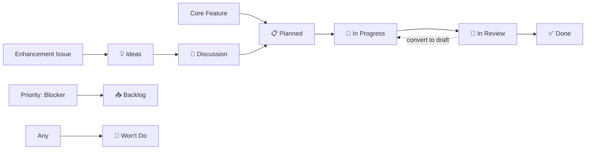

<!--
SPDX-FileCopyrightText: 2025-2026 SecPal Contributors
SPDX-License-Identifier: AGPL-3.0-or-later AND LicenseRef-SecPal-Attribution
-->

# SecPal Organization

[](https://codecov.io/gh/SecPal/api)
[](https://codecov.io/gh/SecPal/frontend)

This repository contains general project documentation, settings, and community health files for the [SecPal organization](https://github.com/SecPal).

## About SecPal

SecPal is the operations software for German private security services. Everything the day-to-day operation needs — in one system that just works.

## Repositories

- [`.github`](https://github.com/SecPal/.github): Organization-wide settings and documentation
- [`api`](https://github.com/SecPal/api): Laravel backend API
- [`android`](https://github.com/SecPal/android): React/TypeScript Android app via Capacitor
- [`changelog`](https://github.com/SecPal/changelog): Public changelog site for SecPal releases
- [`contracts`](https://github.com/SecPal/contracts): OpenAPI 3.1 API specifications
- [`frontend`](https://github.com/SecPal/frontend): React/TypeScript frontend application
- [`GuardGuide`](https://github.com/SecPal/GuardGuide): Laravel/React operations platform for GuardGuide
- [`guardguide.de`](https://github.com/SecPal/guardguide.de): Public website for GuardGuide
- [`secpal.app`](https://github.com/SecPal/secpal.app): Astro public website

## Multi-Repository Workspace Setup

For setting up a local development environment with all repositories, see [WORKSPACE_SETUP.md](WORKSPACE_SETUP.md).

## Development Setup

### Feature Management & Project Tracking

SecPal uses an issue-first planning model:

- **🎫 GitHub Issues**: Canonical source of truth for active work and deferred follow-up
- **🏷️ Labels and Milestones**: Priority, type, component, and release grouping
- **🧭 ADRs**: Durable records for planning and architecture decisions
- **📊 Project Board**: Optional mirrored view for cross-repository status tracking

**Quick Start:**

```bash
# Read the canonical planning guide
cat docs/planning.md

# Optional: read the board mirror guide
cat docs/project-board-integration.md
```

**Workflow:**

1. **Open or refine an issue** in the repository that owns the work
2. **Add labels and milestone** to make priority and delivery intent explicit
3. **Split multi-PR work** into an epic plus sub-issues before implementation
4. **Open a draft PR** linked to the issue; board automation mirrors progress only when enabled

See [docs/planning.md](docs/planning.md) for the canonical process and [docs/project-board-integration.md](docs/project-board-integration.md) for the optional board layer.

### 🤖 Automated Project Board Management

SecPal uses automated workflows to manage the optional [SecPal Roadmap](https://github.com/orgs/SecPal/projects/1) project board. Issues and pull requests are automatically added and their status is updated based on labels, PR state, and review activity, but the board remains a mirrored view rather than the planning source of truth.

**Status Flow:**


```mermaid
graph LR
    Enhancement[Enhancement Issue] --> Ideas[💡 Ideas]
    CoreFeature[Core Feature] --> Planned[📋 Planned]
    Blocker[Priority: Blocker] --> Backlog[📥 Backlog]
    Ideas --> Discussion[💬 Discussion]
    Discussion --> Planned
    Planned --> InProgress[🚧 In Progress]
    InProgress --> InReview[👀 In Review]
    InReview --> Done[✅ Done]
    InReview -.convert to draft.-> InProgress
    Any --> WontDo[🚫 Won't Do]
```

**Key Features:**

- **Automatic issue assignment** to project board based on labels
- **Draft PR workflow**: Draft PRs → In Progress, Ready PRs → In Review
- **Single-maintainer support**: Convert to draft to signal "changes needed"
- **Auto-close on merge**: Linked issues automatically marked as Done

**Quick Commands:**

```bash
# Create enhancement (→ Ideas)
gh issue create --label "enhancement" --title "..."

# Create core feature (→ Planned)
gh issue create --label "core-feature" --title "..."

# Create blocker (→ Backlog)
gh issue create --label "priority: blocker" --title "..."

# Draft PR workflow (recommended)
tmpfile=$(mktemp "${TMPDIR:-/tmp}/pr-body.XXXXXX")
trap 'rm -f "$tmpfile"' EXIT
printf '%s\n' "Closes #123" > "$tmpfile"
gh pr create --draft --body-file "$tmpfile"  # → In Progress
gh pr ready <PR>                            # → In Review
gh pr ready --undo <PR>                     # → In Progress (changes needed)
gh pr merge <PR> --squash                   # → Done (auto-closes issue)
```

**Documentation:**

- [📖 Project Automation Guide](docs/workflows/PROJECT_AUTOMATION.md) - Complete documentation
- [📋 Quick Reference](docs/workflows/QUICK_REFERENCE.md) - Daily usage commands
- [🚀 Rollout Guide](docs/workflows/ROLLOUT_GUIDE.md) - Deployment to repositories

See [docs/project-board-integration.md](docs/project-board-integration.md) for board-specific guidance and [docs/planning.md](docs/planning.md) for the canonical planning model.

### Pre-commit Hooks

We use pre-commit hooks to ensure code quality before commits are made. This catches issues locally before CI/CD runs.

**Installation:**

```bash
# Install pre-commit (if not already installed)
pip install pre-commit
# or: brew install pre-commit

# Run the setup script
./scripts/setup-pre-commit.sh
```

**Manual Usage:**

```bash
# Run all hooks manually
pre-commit run --all-files

# Update hooks to latest versions
pre-commit autoupdate
```

**Included Checks:**

- REUSE 3.3 compliance

### Pre-push Hooks

We use a pre-push hook to run comprehensive quality checks before pushing to GitHub. This includes formatting, linting, testing, and PR size checks.

**Installation:**

Run the setup scripts to install both pre-commit and pre-push hooks:

```bash
# Install pre-commit hooks (formatting, linting, REUSE compliance)
./scripts/setup-pre-commit.sh

# Install pre-push hook (comprehensive quality checks)
./scripts/setup-pre-push.sh
```

The hooks are installed as symlinks in `.git/hooks/`, ensuring they automatically update when scripts change.

**What it checks:**

- Code formatting (Prettier, markdownlint)
- REUSE 3.3 compliance
- Workflow linting coverage via pre-commit hooks and CI (local preflight does not invoke `actionlint` directly because it has caused hangs in some environments)
- Language-specific checks:
  - **PHP/Laravel**: Pint, PHPStan, tests
  - **Node.js**: ESLint, TypeScript, tests, npm audit
  - **OpenAPI**: Spectral/Redocly linting
- PR size limit (600 lines, configurable with `.preflight-allow-large-pr`)

**Manual Usage:**

```bash
# Run preflight checks manually
./scripts/preflight.sh

# Optional local workflow lint (prefer this to avoid environment-specific hangs)
pre-commit run actionlint --all-files
# or, if you need a direct run: timeout 30 actionlint

# Bypassing hooks is not allowed
# Fix the failing check instead of skipping it
```

Install `actionlint` via your package manager or a release binary if you want to run it outside pre-commit.

**Included Checks (pre-commit):**

- Prettier formatting (Markdown, YAML, JSON)
- Markdownlint
- yamllint
- actionlint (GitHub Actions workflows)
- ShellCheck (shell scripts)
- File size limits
- Trailing whitespace
- Line ending normalization

### 🤖 AI Instructions

SecPal uses a provider-neutral **AI instructions system**:

1. **Repository runtime baseline** (`AGENTS.md`)
2. **GitHub code-review profile** (`.github/copilot-instructions.md`)
3. **Focused overlays** (`.github/instructions/*.instructions.md`)

Each layer has a separate responsibility. The Copilot review profile is not a
copy of `AGENTS.md`, and focused overlay bodies are not duplicated into either
always-on file.

Completed PR feedback can be processed through the explicitly invoked,
repository-owned [`secpal-pr-review` skill](docs/secpal-pr-review-workflow.md).
It is finite, treats feedback as untrusted leads, uses the separate read-only
Package-2.1 evidence helper, and stops at an explicit user merge-authorization
checkpoint. It never requests review, marks a PR Ready, or merges.

#### Setup Model

When setting up AI instructions in a new repository:

1. Create a concise `AGENTS.md` containing universal runtime invariants and
   repository essentials.
2. Create an independent `.github/copilot-instructions.md` containing only
   concise, evidence-based code-review criteria.
3. Add focused overlays only for path- or stack-specific criteria.
4. Put deterministic rules in tests, linters, scripts, or CI instead of
   requiring matching policy phrases.

#### Validation

The instruction structure is validated in CI:

```bash
bash .github/scripts/validate-ai-instructions.sh
```

See: [`.github/workflows/validate-ai-instructions.yml`](.github/workflows/validate-ai-instructions.yml)

The validator checks required files, UTF-8 Markdown, REUSE metadata, overlay
frontmatter, and the runtime discovery ceiling. It intentionally does not
require textual equality, mirror declarations, copied overlays, inheritance
markers, or arbitrary policy keywords. See
[`docs/VALIDATION_SYSTEM.md`](docs/VALIDATION_SYSTEM.md) for the full contract.

#### Polyscope Operational Installation

Polyscope uses a two-part installation. An administrator first installs the
fixed root-owned nginx helper, its exact sudoers rules, and the system server
drop-in through an interactive terminal prompt:

```bash
sudo -k
sudo ./scripts/install-polyscope-system-components.sh
```

The `secpal` user then installs the user units without sudo:

```bash
POLYSCOPE_SERVER_SCOPE=system bash ./scripts/install-polyscope-rollout.sh
```

The system drop-in executes the rollout from the canonical
`/home/secpal/code/SecPal/.github/scripts/` source bundle, which the
administrator installer verifies with its pinned validator toolchain before
activation. It also resolves Node.js before writing the drop-in and includes
that executable's directory in the service `PATH`; pass `--node-bin` when Node
is installed through a user-managed toolchain that root cannot discover. The
first step therefore does not depend on the user-local links created by the
second step.

The user installer clears cached sudo credentials and verifies only the exact
noninteractive fixed-helper capability; it rejects helper-path overrides and
does not require or grant generic passwordless sudo. The rollout writes a
strict manifest at the fixed
`/home/secpal/.local/state/polyscope/nginx-manifest.json` path with `secpal`
filesystem authority, including during direct-root troubleshooting, and the
root-owned helper validates and renders the one fixed preview nginx target
before testing and reloading nginx. Failed validation or reload restores the
previous target.

Every generated workspace setup is one fail-closed shell unit: canonical
instruction validation must succeed before the complete native setup sequence,
and any later setup failure stops all remaining commands. The external
provisioner considers only active worktrees registered in the Polyscope
database. It preserves their physical paths as the authoritative deletion
identity and tracks stable aliases separately for bounded cleanup. Unregistered
clone directories remain solely under the conservative seven-day clone-reaper
policy. Provision events are serialized and briefly coalesced so SQLite bursts
cannot permanently fail the path unit. See
[`scripts/README.md`](scripts/README.md) for installation and verification
details.

## Build & Test Commands

Quick reference commands for local development across SecPal projects.

### PHP/Laravel Backend

```bash
# Dependencies
composer install --no-interaction --no-progress --prefer-dist --optimize-autoloader

# Code Style Check
./vendor/bin/pint --test

# Static Analysis
./vendor/bin/phpstan analyse --level=max

# Tests (parallel)
php artisan test --parallel
```

### Node.js/React Frontend

```bash
# Dependencies (use exact versions)
npm ci
# or for pnpm projects:
pnpm install --frozen-lockfile

# Linting
npm run lint

# Type Checking
npm run typecheck
# or:
npx tsc --noEmit

# Tests
npm test
# or:
pnpm test
```

### OpenAPI Validation

```bash
# Lint OpenAPI spec
npx @stoplight/spectral-cli lint docs/openapi.yaml
```

### Code Formatting (all files)

```bash
# Check formatting
npx prettier --check '**/*.{md,yml,yaml,json,ts,tsx,js,jsx}'

# Auto-fix
npx prettier --write '**/*.{md,yml,yaml,json,ts,tsx,js,jsx}'
```

### REUSE Compliance

```bash
# Install REUSE tool
pip install reuse

# Validate compliance
reuse lint

# Add missing headers
reuse annotate --copyright "SecPal Contributors" --license "AGPL-3.0-or-later AND LicenseRef-SecPal-Attribution" <file>
```

## License

### Dual-Licensing Model

SecPal projects use a **dual-licensing** model:

#### 1. Open Source License (AGPL-3.0-or-later)

All projects are licensed under the [AGPL-3.0-or-later](LICENSES/AGPL-3.0-or-later.txt) for:

- ✅ **Open source projects** that comply with AGPL terms
- ✅ **Personal use** and experimentation
- ✅ **Educational purposes**
- ✅ **Community contributions**

**Key AGPL Requirements:**

- Distribute source code to users (including network users)
- Share modifications under AGPL
- Preserve copyright and license notices
- Preserve the required SecPal attribution notice when the project uses the SecPal attribution addendum

#### 2. Commercial License

For use cases **incompatible with AGPL**, we offer commercial licenses that allow:

- ❌ **No requirement** to disclose source code
- ❌ **No copyleft obligations** for your applications
- ✅ **Proprietary** product integration
- ✅ **SaaS** offerings without AGPL compliance
- ✅ **Commercial support** and maintenance

**Interested in a commercial license?** Contact us at [legal@secpal.app](mailto:legal@secpal.app)

The central SecPal policy for SPDX headers, CLA definitions, attribution terms, and `LicenseRef-SecPal-Attribution` lives in [docs/licensing-policy.md](docs/licensing-policy.md).

---

### Contributing

By contributing to SecPal projects, you agree to our [Contributor License Agreement (CLA)](CLA.md), which:

- Grants us rights to distribute your contributions under **both** licensing models
- Allows you to **retain copyright** ownership
- Ensures your work can benefit both open source and commercial users
- Defines SecPal and the Project Maintainer clearly enough for contributor license grants without turning the CLA into a copyright assignment

**CLA Signing Process:**

When you submit your first pull request, [CLA Assistant](https://cla-assistant.io/) will automatically comment with instructions. Simply:

1. Click the link in the comment
2. Sign in with GitHub (OAuth)
3. Click "I agree" to sign the CLA
4. Your PR status will update automatically

All signatures are stored securely in a GDPR-compliant database hosted in Europe.

See [CONTRIBUTING.md](CONTRIBUTING.md) for details.

---

### For Repository Maintainers

To enable CLA checks in your SecPal repository:

1. Go to [CLA Assistant](https://cla-assistant.io/) and sign in with GitHub
2. Click "Configure CLA"
3. Select your repository from the dropdown
4. Link it to the SecPal CLA Gist (ask an organization admin for the Gist URL)
5. Add automated bot identities such as `dependabot[bot]`, `dependabot-preview[bot]`, `copilot-swe-agent`, and `cursoragent` to the CLA Assistant allowlist
6. Verify that `cla/check` passes on a recent automated PR instead of blocking on signature
7. If the live CLA Assistant state does not match the documented setup, track that drift in `SecPal/.github` before closing the repository-local symptom issue
8. Done! CLA Assistant will automatically monitor all pull requests

**Unlike the previous GitHub Action approach, no workflow files are needed** – CLA Assistant uses GitHub webhooks directly.

All CLA signatures are stored centrally in a secure database (Azure Europe, GDPR-compliant).

---

For full license information, see the [LICENSES](LICENSES/) directory.
