<!--
SPDX-FileCopyrightText: 2025 SecPal
SPDX-License-Identifier: AGPL-3.0-or-later
-->

# SecPal Organization

This repository contains general project documentation, settings, and community health files for the [SecPal organization](https://github.com/SecPal).

## About SecPal

SecPal is a digital guard book and much more. It's the "guard's friend" in every respect. The target group is private, German security services.

## Repositories

- [`.github`](https://github.com/SecPal/.github): Organization-wide settings and documentation
- [`api`](https://github.com/SecPal/api): Laravel backend API
- [`contracts`](https://github.com/SecPal/contracts): OpenAPI 3.1 API specifications
- [`frontend`](https://github.com/SecPal/frontend): React/TypeScript frontend application

## Development Setup

### Feature Management & Project Tracking

SecPal uses a structured approach to feature planning and tracking:

- **📝 Documentation**: Features start in `docs/ideas-backlog.md` and mature to `docs/feature-requirements.md`
- **🎫 Issue Templates**: Use structured templates (`core_feature.yml`, `feature_request.yml`) for consistency
- **📊 Project Board**: Kanban-style tracking with automatic issue assignment
- **🏷️ Labels**: Organized by area (`area: RBAC`, `area: employee-mgmt`), priority (`P0-P3`), and status

**Quick Start:**

```bash
# Set up project board integration and labels
./scripts/setup-project-board.sh

# Read the full workflow guide
cat docs/project-board-integration.md
```

**Workflow:**

1. **New Idea** → Add to `docs/ideas-backlog.md`
2. **Ready to Specify** → Detail in `docs/feature-requirements.md`
3. **Ready to Build** → Create issue via template → Auto-added to Project Board
4. **Track Progress** → Move through Kanban columns: Ideas → Backlog → Ready → In Progress → Done

See [docs/project-board-integration.md](docs/project-board-integration.md) for detailed instructions.

### 🤖 Automated Project Board Management

SecPal uses automated workflows to manage the [SecPal Roadmap](https://github.com/orgs/SecPal/projects/1) project board. Issues and pull requests are automatically added and their status is updated based on labels, PR state, and review activity.

**Status Flow:**

```mermaid
graph LR
    Enhancement[Enhancement Issue] --> Ideas[💡 Ideas]
    CoreFeature[Core Feature] --> Planned[📋 Planned]
    Blocker[Priority: Blocker] --> Backlog[📥 Backlog]
    Ideas --> Discussion[💬 Discussion]
    Discussion --> Planned
    Planned --> InProgress[🚧 In Progress]
    InProgress --> InReview[👀 In Review]
    InReview --> Done[✅ Done]
    InReview -.convert to draft.-> InProgress
    Any --> WontDo[🚫 Won't Do]
```



**Key Features:**

- **Automatic issue assignment** to project board based on labels
- **Draft PR workflow**: Draft PRs → In Progress, Ready PRs → In Review
- **Single-maintainer support**: Convert to draft to signal "changes needed"
- **Auto-close on merge**: Linked issues automatically marked as Done

**Quick Commands:**

```bash
# Create enhancement (→ Ideas)
gh issue create --label "enhancement" --title "..."

# Create core feature (→ Planned)
gh issue create --label "core-feature" --title "..."

# Create blocker (→ Backlog)
gh issue create --label "priority: blocker" --title "..."

# Draft PR workflow (recommended)
gh pr create --draft --body "Closes #123"  # → In Progress
gh pr ready <PR>                            # → In Review
gh pr ready --undo <PR>                     # → In Progress (changes needed)
gh pr merge <PR> --squash                   # → Done (auto-closes issue)
```

**Documentation:**

- [📖 Project Automation Guide](docs/workflows/PROJECT_AUTOMATION.md) - Complete documentation
- [📋 Quick Reference](docs/workflows/QUICK_REFERENCE.md) - Daily usage commands
- [🚀 Rollout Guide](docs/workflows/ROLLOUT_GUIDE.md) - Deployment to repositories

See [docs/project-board-integration.md](docs/project-board-integration.md) for detailed instructions.

### Pre-commit Hooks

We use pre-commit hooks to ensure code quality before commits are made. This catches issues locally before CI/CD runs.

**Installation:**

```bash
# Install pre-commit (if not already installed)
pip install pre-commit
# or: brew install pre-commit

# Run the setup script
./scripts/setup-pre-commit.sh
```

**Manual Usage:**

```bash
# Run all hooks manually
pre-commit run --all-files

# Update hooks to latest versions
pre-commit autoupdate
```

**Included Checks:**

- REUSE 3.3 compliance

### Pre-push Hooks

We use a pre-push hook to run comprehensive quality checks before pushing to GitHub. This includes formatting, linting, testing, and PR size checks.

**Installation:**

The pre-push hook is already configured in `.githooks/pre-push` (version controlled). To enable it:

```bash
# Configure Git to use .githooks directory
git config core.hooksPath .githooks
```

Or run the setup script:

```bash
./scripts/setup-pre-push.sh
```

**What it checks:**

- Code formatting (Prettier, markdownlint)
- REUSE 3.3 compliance
- Workflow linting (actionlint - **disabled locally**, runs in CI only due to network timeout issues when checking workflows; actionlint attempts to fetch GitHub API metadata which can hang indefinitely in some network configurations)
- Language-specific checks:
  - **PHP/Laravel**: Pint, PHPStan, tests
  - **Node.js**: ESLint, TypeScript, tests, npm audit
  - **OpenAPI**: Spectral/Redocly linting
- PR size limit (600 lines, configurable with `.preflight-allow-large-pr`)

**Manual Usage:**

```bash
# Run preflight checks manually
./scripts/preflight.sh

# Skip checks (not recommended)
git push --no-verify
```

**Included Checks (pre-commit):**

- Prettier formatting (Markdown, YAML, JSON)
- Markdownlint
- yamllint
- actionlint (GitHub Actions workflows)
- ShellCheck (shell scripts)
- File size limits
- Trailing whitespace
- Line ending normalization

### 🤖 Copilot Instructions & Templates

SecPal uses a **two-tier Copilot instructions system**:

1. **Organization-wide rules** (`.github/copilot-instructions.md` in this repo)
2. **Repository-specific rules** (`.github/copilot-instructions.md` in each repo)

**All repository-specific instruction files MUST include a reminder** to read the org-wide instructions first.

#### Using the Template

When setting up Copilot instructions in a new repository:

1. **Copy the reminder block** from `templates/copilot-instructions-reminder.md`
2. **Place it at the top** of `.github/copilot-instructions.md` (after SPDX headers)
3. **Add repo-specific rules** below the reminder
4. **Create a PR** with title pattern: `docs: add org-wide instructions reminder`

**Template Location:** [`templates/copilot-instructions-reminder.md`](templates/copilot-instructions-reminder.md)

**Example Implementations:**

- [SecPal/api #76](https://github.com/SecPal/api/pull/76) ✅ Merged
- [SecPal/frontend #54](https://github.com/SecPal/frontend/pull/54) ✅ Merged
- [SecPal/contracts #38](https://github.com/SecPal/contracts/pull/38) ✅ Merged

#### Validation

The reminder is **required** in all repositories. CI validates its presence:

```bash
# Check for reminder marker
grep -q "🚨 AI MUST READ ORGANIZATION-WIDE INSTRUCTIONS FIRST" .github/copilot-instructions.md
```

See: [`.github/workflows/validate-copilot-instructions.yml`](.github/workflows/validate-copilot-instructions.yml)

#### Why This Matters

**Without the reminder:** AI assistants might read repo-specific rules without seeing critical org-wide policies, leading to:

- Quality gate bypasses
- Missing Copilot PR reviews
- TDD policy violations
- Security requirement oversights

**With the reminder:** AI **always** reads organization-wide rules (Copilot Review Protocol, Quality Gates, TDD Policy, Security) before processing repo-specific instructions.

## Build & Test Commands

Quick reference commands for local development across SecPal projects.

### PHP/Laravel Backend

```bash
# Dependencies
composer install --no-interaction --no-progress --prefer-dist --optimize-autoloader

# Code Style Check
./vendor/bin/pint --test

# Static Analysis
./vendor/bin/phpstan analyse --level=max

# Tests (parallel)
php artisan test --parallel
```

### Node.js/React Frontend

```bash
# Dependencies (use exact versions)
npm ci
# or for pnpm projects:
pnpm install --frozen-lockfile

# Linting
npm run lint

# Type Checking
npm run typecheck
# or:
npx tsc --noEmit

# Tests
npm test
# or:
pnpm test
```

### OpenAPI Validation

```bash
# Lint OpenAPI spec
npx @stoplight/spectral-cli lint docs/openapi.yaml
```

### Code Formatting (all files)

```bash
# Check formatting
npx prettier --check '**/*.{md,yml,yaml,json,ts,tsx,js,jsx}'

# Auto-fix
npx prettier --write '**/*.{md,yml,yaml,json,ts,tsx,js,jsx}'
```

### REUSE Compliance

```bash
# Install REUSE tool
pip install reuse

# Validate compliance
reuse lint

# Add missing headers
reuse annotate --copyright "SecPal" --license "AGPL-3.0-or-later" <file>
```

## License

### Dual-Licensing Model

SecPal projects use a **dual-licensing** model:

#### 1. Open Source License (AGPL-3.0-or-later)

All projects are licensed under the [AGPL-3.0-or-later](LICENSES/AGPL-3.0-or-later.txt) for:

- ✅ **Open source projects** that comply with AGPL terms
- ✅ **Personal use** and experimentation
- ✅ **Educational purposes**
- ✅ **Community contributions**

**Key AGPL Requirements:**

- Distribute source code to users (including network users)
- Share modifications under AGPL
- Preserve copyright and license notices

#### 2. Commercial License

For use cases **incompatible with AGPL**, we offer commercial licenses that allow:

- ❌ **No requirement** to disclose source code
- ❌ **No copyleft obligations** for your applications
- ✅ **Proprietary** product integration
- ✅ **SaaS** offerings without AGPL compliance
- ✅ **Commercial support** and maintenance

**Interested in a commercial license?** Contact us at [legal@secpal.app](mailto:legal@secpal.app)

---

### Contributing

By contributing to SecPal projects, you agree to our [Contributor License Agreement (CLA)](CLA.md), which:

- Grants us rights to distribute your contributions under **both** licensing models
- Allows you to **retain copyright** ownership
- Ensures your work can benefit both open source and commercial users

**CLA Signing Process:**

When you submit your first pull request, [CLA Assistant](https://cla-assistant.io/) will automatically comment with instructions. Simply:

1. Click the link in the comment
2. Sign in with GitHub (OAuth)
3. Click "I agree" to sign the CLA
4. Your PR status will update automatically

All signatures are stored securely in a GDPR-compliant database hosted in Europe.

See [CONTRIBUTING.md](CONTRIBUTING.md) for details.

---

### For Repository Maintainers

To enable CLA checks in your SecPal repository:

1. Go to [CLA Assistant](https://cla-assistant.io/) and sign in with GitHub
2. Click "Configure CLA"
3. Select your repository from the dropdown
4. Link it to the SecPal CLA Gist (ask an organization admin for the Gist URL)
5. Done! CLA Assistant will automatically monitor all pull requests

**Unlike the previous GitHub Action approach, no workflow files are needed** – CLA Assistant uses GitHub webhooks directly.

All CLA signatures are stored centrally in a secure database (Azure Europe, GDPR-compliant).

---

For full license information, see the [LICENSES](LICENSES/) directory.
