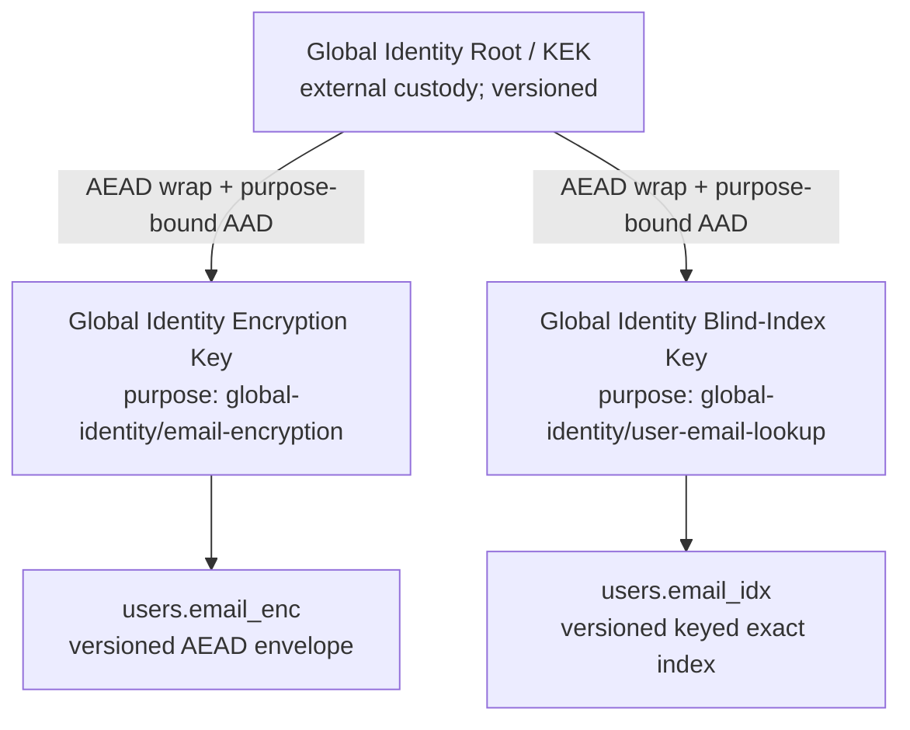
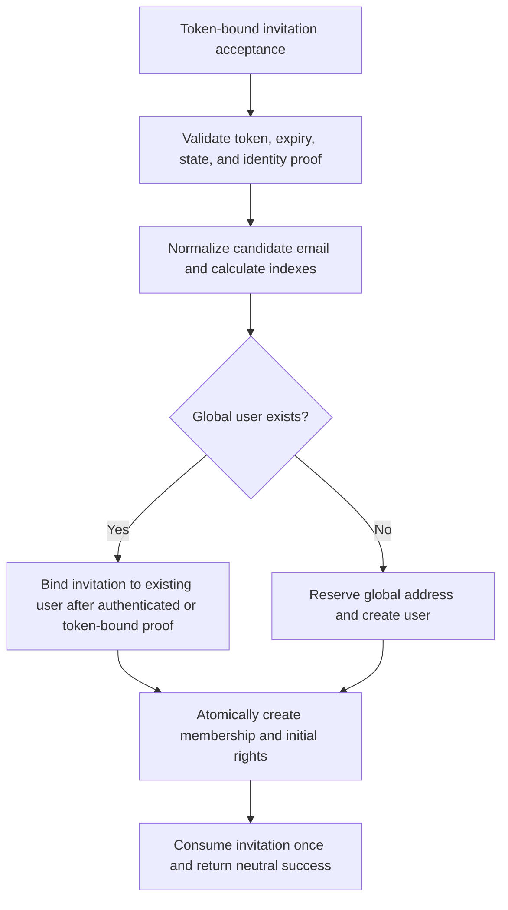

<!--
SPDX-FileCopyrightText: 2026 SecPal Contributors
SPDX-License-Identifier: CC0-1.0
-->

# ADR-015: Global Identity Key Security

**Status:** Proposed

**Date:** 2026-07-20

**Decision authority:** SecPal Product and Domain Owner

**Related:** [ADR-014](20260720-tenant-identity-access-model-adr014.md)

## Relationship to ADR-014

[ADR-014](20260720-tenant-identity-access-model-adr014.md) is accepted and is the binding architectural baseline. It establishes a global user identity, tenant memberships, and a Global Identity Key boundary distinct from tenant data. This ADR only specifies the security design inside that boundary. It neither weakens nor reopens ADR-014.

This ADR is proposed. Its implementation details must not be treated as accepted until the decision authority accepts it.

## Context

A global identity must be discoverable by an exact email address before a tenant membership is selected. Tenant envelope keys therefore cannot encrypt or index global user identity data: no tenant exists in the authentication context, and the same user may belong to multiple tenants. At the same time, persistent plaintext email creates material disclosure, correlation, phishing, and account-enumeration risk in database dumps, backups, operational logs, and queued payloads.

The design needs an exact, globally unique email lookup without decrypting every user, an authenticated and context-bound ciphertext, independently rotatable encryption and index keys, a practical self-hosted root-key model, and a future path to KMS or HSM custody. It must also define how authentication and identity lifecycle flows stop using plaintext email as a persistent key.

## Current state

The following findings are based on the current `SecPal/api` `main` workspace at commit `3d0d6457689438af4d108d3ca2ae10469cc8fbdd`.

### Current tenant key hierarchy

- `app/Models/TenantKey.php` loads one filesystem KEK from `KEK_PATH`, defaulting to `storage/app/keys/kek.key`, requires 32 bytes and mode `0600`, and refuses insecure or unreadable files.
- Each `tenant_keys` row stores a wrapped random DEK and a separately wrapped random index key, their nonces, and one `key_version`. Binary values are base64-encoded through the custom binary cast into string columns.
- KEK publication uses a cryptographically random libsodium key and an atomic temporary-file plus hard-link procedure. Tenant DEKs and index keys are generated with `sodium_crypto_secretbox_keygen()`.
- Key wrapping and field encryption use libsodium `crypto_secretbox` (XSalsa20-Poly1305) with a fresh random 24-byte nonce. The authentication tag is embedded in the returned ciphertext.
- Blind indexes use binary HMAC-SHA-256 with the tenant index key.
- `app/Casts/EncryptedWithDek.php` persists JSON containing base64 `ciphertext` and `nonce`, resolves `TenantKey` from `tenant_id`, and has no format version, algorithm identifier, key version in the ciphertext, explicit purpose, model/field binding, record binding, or AAD.
- `keys:generate-kek`, `keys:generate-tenant`, and `tenant:setup` provision the existing hierarchy. `keys:rotate-dek` re-encrypts selected `Person` fields before replacing the tenant DEK; it is not resumable and skips malformed records. `keys:rotate-kek` writes a timestamped adjacent backup, replaces the KEK, and then rewraps tenant rows one by one; interruption can leave a mixed state. No implemented command rotates the tenant blind-index key; documentation refers to a rebuild path that does not provide an equivalent key lifecycle.
- Deployment and provisioning documentation treats the filesystem KEK as critical offline-backup material and database dumps as containing wrapped tenant keys. Restore guidance is fragmented and does not provide a version-aware, tested recovery protocol.

This tenant hierarchy is useful implementation evidence, but it is not the Global Identity Key boundary. Global user data must not resolve a `TenantKey` or use `tenant_id` to select cryptographic material.

### Current `APP_KEY` dependency

`APP_KEY` remains a broad Laravel runtime boundary. It protects framework-encrypted values and cookies and is used by the installed MFA package's `encrypted` casts for TOTP shared secrets and recovery-code collections. It also supports other application features such as encrypted form data and application-derived integrity material. Losing or changing it can invalidate sessions and make those encrypted values unreadable.

The existing tenant KEK is a separate file and is not derived from `APP_KEY`. The target global identity hierarchy must likewise be independently rooted. `APP_KEY` may continue to serve framework purposes, but it is neither the sole nor the authoritative Global Identity Key boundary.

### Current global identity and authentication state

- `users.email` is a unique plaintext string. `User` exposes it, uses Laravel email verification, stores a password hash and remember token, owns Sanctum tokens, passkeys, MFA state, and a current `tenant_id` relationship that ADR-014 requires later work to remove.
- Session and token login perform `User::where('email', ...)`, use a dummy password hash for unknown accounts, and return a uniform invalid-credential error. Login rate limits derive cache keys from lowercased, trimmed plaintext input and IP address.
- Password reset looks up users and `password_reset_tokens` by plaintext email. Reset tokens are bcrypt-hashed and single-use under a row lock, but the queued mailable serializes a `User` and plaintext token, and the reset URL contains plaintext email.
- Email verification binds a signed route to `user_id` and a SHA-1 digest of the current email, then calls Laravel's verification helpers. Resend is authenticated.
- No dedicated, step-up-authenticated pending email-change workflow exists. Onboarding can overwrite `user.email`, clear verification, and then mark it verified after invitation-token completion.
- Invitation/onboarding uses a bcrypt token plus an unkeyed SHA-256 lookup hash. The public validation and completion endpoints require token plus plaintext employee email, compare the email case-sensitively, and place both email and token in the invitation URL. Invitation delivery currently sends synchronously.
- MFA login challenges contain only `user_id`, context, and device name in cache. TOTP shared secrets and recovery codes use Laravel encryption under `APP_KEY`; TOTP anti-replay keys contain user-scoped state. MFA audit properties currently include user email.
- Passkey authentication is discoverable and usernameless: cached challenges do not contain email, credential verification resolves the user through stored passkey metadata, and registration is bound to authenticated `user_id` with password step-up. Passkey metadata is plaintext but includes no required email lookup.
- Sanctum personal access tokens are hashed in the database; sessions and remember tokens are user-ID-bound. Logout-all, password reset, lifecycle deprovisioning, and deletion revoke tokens and sessions by `user_id`.
- Mailables and lifecycle services frequently receive full models or raw addresses. Some queued mail therefore risks serializing identity-bearing models; mail delivery failures and activity logs currently include plaintext email.
- Factories, seeders, and authentication, onboarding, MFA, passkey, mail, session, lifecycle, rate-limit, and logging tests construct or assert plaintext `email` fields and queries.

## Assets and classification

| Asset                           | Classification and required treatment                                                                                                                                                 |
| ------------------------------- | ------------------------------------------------------------------------------------------------------------------------------------------------------------------------------------- |
| Original email                  | Personal data and authentication identifier; transient plaintext only at validated input, authorized display, or immediate mail delivery boundaries.                                  |
| Normalized email                | High-value correlation and lookup material; never persisted or logged in plaintext.                                                                                                   |
| Blind index                     | Pseudonymous deterministic identifier; confidential metadata subject to equality, frequency, and guessing leakage.                                                                    |
| Password hash                   | Credential verifier; use the framework's memory-hard/password hashing policy, never encrypt as a substitute for hashing.                                                              |
| Reset and verification tokens   | Bearer credentials; store only keyed or password hashes, bind to `user_id` or a pending operation, expire, and consume once.                                                          |
| Invitation addresses            | Personal data; store encrypted with an invitation-specific purpose or reference an existing `user_id`; do not reuse the user lookup index.                                            |
| MFA secrets                     | High-impact credentials; encrypt under a dedicated Global Identity credential purpose, not merely `APP_KEY`. Recovery codes remain one-time verifiers.                                |
| Passkey metadata                | Authentication metadata, including credential ID, public key, AAGUID, transports, counters, and backup state; protect access and minimize disclosure, but public keys are not secret. |
| Session and access tokens       | Bearer credentials; persist only established hashes or opaque session state, bind to `user_id`, expire or revoke according to policy.                                                 |
| Global Identity Root/KEK        | Critical root secret; never store plaintext in the database, application logs, images, or the same backup set as database data.                                                       |
| Encryption keys                 | Confidential working keys; randomly generated, purpose-bound, versioned, wrapped at rest, and zeroized when practical.                                                                |
| Blind-index keys                | Confidential high-value guessing-oracle keys; separate from encryption keys, purpose-bound, versioned, and wrapped at rest.                                                           |
| Key versions and metadata       | Integrity-sensitive operational metadata; database-backed, audited, backed up, and validated before use.                                                                              |
| Backups                         | Potentially complete historical disclosure set; encrypted, access-controlled, version-aware, and separated from root-secret backups.                                                  |
| Logs, traces, and error reports | Broadly replicated operational data; must contain identifiers, versions, event types, and redacted diagnostics, not plaintext identity data or secrets.                               |

## Threat model

| Scenario                                                | Required protection and residual risk                                                                                                                                                                                                                                                 |
| ------------------------------------------------------- | ------------------------------------------------------------------------------------------------------------------------------------------------------------------------------------------------------------------------------------------------------------------------------------- |
| 1. Isolated database exfiltration                       | Email ciphertext and wrapped keys do not disclose email without root and working keys. A keyed index prevents direct hashing but still leaks equality, frequency, row relationships, and enables guesses only after index-key compromise.                                             |
| 2. Database and object-storage exfiltration             | The same guarantee applies to encrypted database and object data if root material and runtime secrets are absent. Storage metadata and access patterns may remain visible.                                                                                                            |
| 3. Backup exfiltration                                  | Encrypted database backups remain protected when root-secret backups are separately controlled. Historical ciphertext and index versions increase the attack window.                                                                                                                  |
| 4. Log or error-tracking exfiltration                   | Redaction and identifier-only events prevent logs from becoming a plaintext identity replica. Operational metadata still leaks event timing and user IDs.                                                                                                                             |
| 5. Loss of `APP_KEY`                                    | Global email encryption and lookup remain recoverable because their root is independent. Framework cookies, sessions, current MFA ciphertexts, and other Laravel-encrypted values may fail until separately migrated or recovered.                                                    |
| 6. Global Identity Root compromise                      | An attacker with the database can unwrap all retained global identity keys and decrypt data or compute indexes. Emergency root rotation limits future exposure but cannot undo prior disclosure.                                                                                      |
| 7. Encryption-key compromise                            | Ciphertexts for that key version become readable. Blind indexes remain protected by a separate key. Re-encryption and credential review are required.                                                                                                                                 |
| 8. Blind-index-key compromise                           | Email guesses can be tested offline and matching rows correlated, but ciphertext remains confidential. Re-indexing and abuse review are required.                                                                                                                                     |
| 9. Ciphertext manipulation                              | AEAD authentication plus AAD binding causes a fail-closed integrity error; modified data is never returned or silently repaired.                                                                                                                                                      |
| 10. Offline email-index dictionary attacks              | HMAC prevents testing without the index key. If the index key is stolen, the low-entropy and enumerable nature of many addresses permits guessing; rate limits do not protect an offline attacker.                                                                                    |
| 11. Account enumeration                                 | Login, reset, invitation, verification, and registration endpoints use neutral externally observable responses and comparable work where practical. Internal audits must not expose existence to unauthorized callers.                                                                |
| 12. Concurrent registration                             | Database uniqueness plus transaction-scoped serialization across every accepted index version permits exactly one global identity for a normalized address. Losers receive a neutral conflict outcome.                                                                                |
| 13. Concurrent email change                             | A globally unique pending reservation and row locking permit only one active owner; activation is atomic and stale operations cannot overwrite a newer request.                                                                                                                       |
| 14. Faulty rotation                                     | Versioned keys, resumable checkpoints, authenticated test reads, reference counts, and explicit completion criteria prevent premature key deletion and expose partial progress.                                                                                                       |
| 15. Restore of an old backup                            | The recovery set must retain every key version referenced by the backup. Restore runs isolated, detects the restored rotation epoch, and completes or rolls back the relevant cryptographic phase before serving traffic.                                                             |
| 16. Complete control of the running application process | Application encryption does not protect plaintext or loaded keys from an attacker controlling the process, debugger, host memory, or authorized decryption path. KMS/HSM custody can reduce key export but cannot stop an authorized compromised process from requesting decryptions. |
| 17. Permanent loss of all root material                 | Encrypted global identity data and wrapped working keys become permanently unrecoverable. No bypass, default key, or plaintext fallback is allowed.                                                                                                                                   |

Application-layer encryption primarily protects data at rest from isolated database, storage, backup, log, and snapshot disclosure where root secrets and the live process are not compromised. It does not protect against a fully compromised running process, malicious authorized application behavior, plaintext captured before encryption or after decryption, endpoint compromise, or an attacker holding both the relevant ciphertext and keys.

## Security goals

- Keep persistent global email plaintext and normalized plaintext out of databases, backups, queues, logs, traces, and error payloads.
- Provide exact global identity lookup and database-enforced uniqueness without decryption or full-table scanning.
- Separate global identity from all tenant keys and separate encryption from indexing cryptographically and operationally.
- Authenticate every ciphertext and bind it to its purpose, model, field, record, and format.
- Support independent, resumable, auditable rotation and tested recovery for every key layer.
- Fail closed when key material, versions, context, or ciphertext integrity is invalid.
- Make safe self-hosting practical while preserving a stable wrapping interface for later KMS or HSM custody.

## Non-goals

- Hiding row counts, access patterns, equality, or frequency of exact lookups from a database observer.
- Protecting data from an attacker with complete control of the running application process.
- Supporting fuzzy, substring, domain, or full-text search over email addresses.
- Defining tenant-data encryption, employee-data encryption, or membership authorization beyond the boundary fixed by ADR-014.
- Implementing migrations, compatibility paths, code, secrets, key generation, rotation, or deployment changes in this ADR.
- Treating encryption as a replacement for authorization, TLS, token hashing, password hashing, rate limits, host hardening, or least privilege.

## Binding decision

Global identity data uses a dedicated envelope hierarchy and never a `TenantKey`. `APP_KEY` is not its sole or authoritative root. Encryption and blind indexing use separately generated working keys with explicit purposes and independent versions. Raw working keys are stored only as authenticated wrapped values; raw root material is never stored in the database.

The first self-hosted operating model uses a 256-bit random Global Identity Root/KEK in a root-owned or service-owned file outside the web root and code checkout, mounted read-only where practical, restricted to the application identity, and backed up separately under encryption and dual-control recovery procedures. The application accesses it through a `GlobalIdentityKeyWrapper` boundary. A later implementation may replace the filesystem wrapper with a KMS/HSM-backed wrap/unwrap provider without changing ciphertext or index consumers.

No custom cryptographic primitive is permitted. Implementations use a maintained, reviewed library and operating-system CSPRNG. Static nonces, unauthenticated encryption, and nonce reuse with the same key are prohibited.

## Key hierarchy



Each key record has a stable key ID, numeric version, purpose, algorithm, lifecycle state, creation/activation timestamps, wrapped key bytes, wrapping nonce, wrapping algorithm, root/KEK version, and non-secret audit metadata. The root derives no working key by reusing raw bytes. Working keys are independently random. If derivation is later required inside an HSM, a standard KDF with distinct, fixed purpose labels and contexts must provide equivalent domain separation.

The minimum purpose labels are:

- `secpal/global-identity/email-encryption/v1`;
- `secpal/global-identity/user-email-lookup/v1`;
- distinct labels for invitation addresses, pending email changes, MFA credentials, and any future persistent index.

## Email storage and encryption format

The target user schema contains `users.email_enc` and `users.email_idx`. It contains no persistent plaintext `users.email`, no persistent normalized-email column, no fallback plaintext field, and no permanent compatibility or dual-write phase.

`users.email_enc` is a PostgreSQL `jsonb` authenticated envelope with this logical schema:

```json
{
  "format_version": 1,
  "algorithm": "XCHACHA20-POLY1305-IETF",
  "key_version": 1,
  "nonce": "<base64url-no-padding>",
  "ciphertext": "<base64url-no-padding>",
  "authentication_tag": "<base64url-no-padding>"
}
```

Version 1 uses libsodium XChaCha20-Poly1305-IETF with a 256-bit key, a fresh uniformly random 192-bit nonce for every encryption, and a 128-bit authentication tag. The maintained library's combined ciphertext output may be split into ciphertext and tag only for serialization and must be recombined exactly for library verification. Nonces are not secret, but reuse with the same key is forbidden. Tests and metrics detect collisions; a detected collision is a security incident and blocks the write.

The AEAD additional authenticated data is the UTF-8 encoding of a fixed, unambiguous, versioned context containing:

```text
key_purpose = secpal/global-identity/email-encryption/v1
model_type = user
field = email_enc
user_id = canonical lowercase UUID
format_version = 1
```

The implementation must define one canonical field order and length-delimited encoding, test it with fixed vectors, and never serialize language-native objects implicitly. The AAD is not stored as trusted input; it is reconstructed from the record and fixed constants. Moving ciphertext to another user, field, purpose, model, or format fails authentication.

Unknown formats, algorithms, or key versions; invalid base64url; wrong nonce or tag lengths; missing fields; extra security-relevant ambiguity; incorrect AAD; and failed authentication all fail closed. No caller receives partial plaintext, and no fallback key or legacy plaintext lookup is attempted.

## Email normalization

All flows use exactly one `normalizeEmailV1` implementation before indexing, uniqueness checks, comparison, or encryption. Version 1 performs these steps in order:

1. Accept a UTF-8 string and remove Unicode `White_Space` code points only from both ends. Interior whitespace is not altered.
2. Normalize the complete value to Unicode NFC. Reject malformed UTF-8 or unavailable normalization support.
3. Split at the single final `@`; require a non-empty local part and domain and reject additional unquoted structural ambiguity. Quoted local parts and comments are not accepted in version 1.
4. Apply Unicode default case folding to the local part, then NFC again. This makes global identity lookup intentionally case-insensitive. Do not change dots, plus suffixes, or provider-specific aliases.
5. Convert the domain with UTS #46 non-transitional IDNA processing and STD3 rules to ASCII A-label form, reject all IDNA errors, and lowercase the ASCII result. A trailing root dot is rejected rather than silently removed.
6. Validate the normalized `local@domain` as a deliverable address under the application's maintained email-validation library, including DNS-independent syntax rules. Require local part at most 64 UTF-8 octets, each domain label at most 63 ASCII octets, domain at most 253 ASCII octets, and complete normalized address at most 254 octets.
7. Return the normalized UTF-8 local part, one ASCII `@`, and lowercase ASCII domain. Invalid input produces a generic validation error before any lookup and is never persisted.

This deliberate case-insensitive local-part policy trades theoretical SMTP local-part case sensitivity for predictable global identity semantics. SecPal does not remove Gmail-style dots, strip plus suffixes, apply provider alias rules, or heuristically merge distinct addresses.

Normalization behavior is versioned independently from ciphertext format. A future normalization version requires collision analysis, an explicit reservation/re-index procedure, and a separate architectural decision if it changes identity equivalence.

## Blind-index design

For user lookup:

```text
email_idx = HMAC-SHA-256(user_email_lookup_index_key, normalizeEmailV1(email))
```

- The HMAC key is the active, independently random Global Identity Blind-Index Key for purpose `secpal/global-identity/user-email-lookup/v1`.
- `users.email_idx` is PostgreSQL `bytea`, exactly 32 bytes. It is never hex or base64 text in the database.
- `users.email_idx_key_version` is a non-null integer identifying the index-key version. A unique constraint covers the active `users.email_idx`; rotation metadata additionally enforces uniqueness per accepted version.
- Comparisons use database binary equality. Any application comparison outside the database uses a maintained constant-time comparison function.
- Exact lookup calculates candidate HMACs for the small, explicit set of accepted read versions and queries indexed binary values. It never decrypts for search and never scans or decrypts the user table.
- Writes use only the designated write version, except that a time-limited cryptographic index rotation records both required version representations in the rotation structure described below. This is not a compatibility layer with plaintext or an old product model.

The index necessarily leaks equality: equal normalized emails under the same purpose and key version produce equal values. It also leaks frequency if duplicate-capable datasets use the same purpose. The unique user index suppresses duplicate row frequency but still reveals equality checks and correlations with access patterns. HMAC prevents a database-only attacker from computing guesses; it does not prevent offline dictionary attacks after the index key is compromised. Email addresses have limited entropy and are often enumerable, so index-key custody, purpose separation, rotation, breach response, and data minimization remain essential.

### Concurrency and global uniqueness

Registration, invitation acceptance that creates a user, and email activation run in a database transaction. They compute candidate indexes for every accepted lookup version, acquire transaction-scoped advisory locks derived from those binary candidates in a stable order, check both active user rows and rotation reservations, and then insert or activate. Database unique constraints are the final guard. A conflict returns a neutral response and never reveals whether the winner is an existing account, pending registration, or pending email change.

## Index purpose separation

The user lookup index is not reused across tables. Reuse would let a database-only attacker correlate the same address across user, invitation, reset, and security-event datasets.

| Purpose                                 | Persistent representation                                                                                                                                                                                                                         |
| --------------------------------------- | ------------------------------------------------------------------------------------------------------------------------------------------------------------------------------------------------------------------------------------------------- |
| User login and global uniqueness        | `users.email_idx` with the user-lookup purpose and version; required.                                                                                                                                                                             |
| Invitations for an existing user        | Store `user_id`; do not store another email index. Resolve the delivery address at send time.                                                                                                                                                     |
| Invitations for a not-yet-existing user | Store authenticated ciphertext under an invitation-address purpose. If exact deduplication is required, use an invitation-specific index key/purpose; never the user index.                                                                       |
| Pending email change                    | Store encrypted candidate address plus a purpose-specific global uniqueness reservation. The reservation may use the user lookup family only inside the controlled ownership/rotation protocol; it is not exposed as a general cross-table index. |
| Password reset                          | Store `user_id`, token hash, expiry, and creation time. No email value or email index is stored.                                                                                                                                                  |
| Email verification                      | Bind to `user_id` and the current email version, or to a concrete pending-change operation. No email lookup field is stored.                                                                                                                      |
| Rate limiting                           | Use HMAC of normalized input under a short-lived rate-limit purpose key plus IP/scope as needed, or `user_id` after lookup. Never place plaintext or a reusable database index in cache keys.                                                     |
| Security events                         | Store `user_id` when known and a non-reversible event-scoped correlation identifier when unknown. Do not store email, normalized email, or the persistent user index.                                                                             |

## Login flow


The plaintext input exists only for the request. Login uses indexed lookup, preserves uniform invalid-credential responses and comparable password-hash work, and does not decrypt email to authenticate. Successful presentation may decrypt the address only when an authorized response actually needs it. Membership selection and authorization occur after global authentication as required by ADR-014.

Passkey discovery remains email-independent and resolves `user_id` from credential metadata. MFA challenges remain `user_id`-bound. Rate-limit and audit changes must remove plaintext email without weakening existing anti-enumeration behavior.

## Invitation and registration



- Invitation creation chooses `user_id` when an identity already exists. Otherwise it stores only invitation-purpose ciphertext and a single-use, hashed token.
- Public request and repeat/replay failures are neutral. Possession of an address alone never confirms account existence.
- Acceptance is bound to the invitation token and its intended operation. Identity proof and mailbox verification rules remain explicit; an invitation token is consumed exactly once.
- User creation, global-address ownership, membership, initial rights, and invitation consumption are atomic. A parallel or repeated acceptance either observes the committed result idempotently where safe or returns the same neutral conflict/failure response.
- Queued invitation work carries an invitation record ID, not plaintext email or a full model snapshot. The worker decrypts only at the delivery boundary.

## Password reset

The preferred persistent model is:

```text
user_id
token_hash
expires_at
created_at
```

The reset-request endpoint normalizes and indexes the submitted email, resolves `user_id`, performs equalized work for missing accounts, and returns one neutral response. It stores only a strong token hash bound to `user_id`; plaintext email is not a table key, lookup key, URL parameter, log property, or job payload. The delivery job contains a reset-operation ID or `user_id` plus an encrypted record reference. The plaintext token exists only at generation and delivery boundaries.

Reset consumption locks the operation, checks expiry and the maintained token-hash verifier, changes the password, consumes all outstanding reset operations, clears remember state, and revokes sessions and access tokens atomically. Replay and parallel consumption permit one winner.

## Email verification

Verification is bound to `user_id`, the current email version, and a single-use verification operation, or to one explicit pending email-change operation. The stored token is hashed, expires, and is consumed once. The verification URL needs an opaque operation identifier and token, not email. A signature derived from plaintext email is not the identity binding.

Verification of the active address updates only that exact email version. Verification of a pending address does not mutate the active address until the email-change activation transaction succeeds. Resend uses `user_id` and invalidates or supersedes prior operations according to policy.

## Email change

1. Require recent step-up authentication using password plus MFA/passkey according to account policy.
2. Normalize the new address, reject a no-op against the current address, calculate indexes, and reserve global uniqueness under transaction-scoped locks.
3. Persist the candidate only as purpose-bound authenticated ciphertext in a pending operation with expiry, requester `user_id`, operation version, and hashed verification token. Never replace the active email before verification.
4. Send verification to the candidate address by pending-operation ID. Send a security notification to the old active address without placing either address in logs or job payloads.
5. On token consumption, lock the user and pending reservation, recheck uniqueness across accepted index versions, and atomically write new `email_enc`, `email_idx`, and versions; mark verified; release the old index; consume competing pending operations; and record an audit event.
6. Revoke old password-reset and email-verification operations, remember tokens, sessions, and access tokens according to the credential-revocation policy. Require fresh login unless the accepted product policy explicitly preserves the initiating session.
7. Concurrent changes for one user use a monotonically increasing operation version; only the latest active operation may win. Concurrent claims by different users are serialized by the global reservation protocol.

Cancellation, expiry, failure, or lost-key conditions release reservations safely and leave the old active email unchanged.

## Mail decryption boundary

Email is decrypted only immediately before handing a recipient address to the mail transport or rendering an authorized response that requires it. Delivery workers receive `user_id`, invitation/reset/change operation ID, or an encrypted record reference. Persistent queue payloads, failed-job tables, retry metadata, exception contexts, and monitoring events must not contain plaintext email, normalized email, decrypted model snapshots, or complete tokens.

Mail delivery fails closed if the required key or ciphertext cannot be authenticated. The system records a redacted delivery failure keyed by operation ID, user ID where known, key version, and error class. It does not fall back to a plaintext column or guess another recipient.

## Rotation

All rotations require an approved operation ID, current backups and recovery test, healthy key registry, no unresolved integrity errors, capacity monitoring, and an audit sink that does not contain secrets. A rotation is a state machine with durable checkpoints and idempotent batches.

### Encryption-key rotation

1. Create and wrap a new encryption-key version; verify unwrap and test-vector encryption before activation.
2. Mark it `write-active`. New writes use it; reads select the exact version in each envelope and continue accepting retained read versions.
3. Re-encrypt batches with row locks or compare-and-swap on ciphertext/version. Each batch authenticates old AAD, decrypts in memory, encrypts with a fresh nonce and the same record-bound AAD, commits, checkpoints, and audits counts without values.
4. Resume from durable checkpoints after interruption. Failed records remain on the old readable version and block completion.
5. Completion requires zero references to old versions, full integrity sampling or verification, successful backup/restore rehearsal, and reconciled counts.
6. Mark old keys decrypt-only, then retired. Delete wrapped old keys only after all live data and every retained backup no longer references them and policy authorizes destruction. Rollback can return writes to the old key only before new-only data or key destruction makes that unsafe.

### Blind-index-key rotation

1. Create, wrap, and verify a new index-key version. Keep the old version accepted for reads.
2. Create a time-limited cryptographic rotation structure holding `(user_id, key_version, email_idx)` with unique `(key_version, email_idx)` constraints and lifecycle state. It contains no plaintext.
3. For each user, decrypt `email_enc`, normalize, compute old and new indexes, verify the old value, and persist the new reservation in an idempotent transaction.
4. During rotation, lookups calculate both versions. Registrations and email changes calculate, lock, check, and reserve both versions so global uniqueness holds across old-only, new-only, and migrated rows.
5. After every user has a verified new reservation, atomically or in guarded batches move the new value/version into `users.email_idx`; writes continue to maintain both representations until cutover completes.
6. Completion requires one verified new index per user, no duplicates or unresolved collisions, no old-version-only rows, successful login and concurrency tests, and a recovery checkpoint. Then stop old-version writes, remove old rotation entries, and retire the old key subject to backup retention.

This dual-index interval is an explicitly time-limited cryptographic rotation phase. It is not a plaintext dual write, a legacy product compatibility layer, or permission to retain a permanent second identity model.

### Root/KEK rotation

1. Provision a new root version in separate custody and verify access without replacing the old root.
2. Read each wrapped working key with its recorded old root version and rewrap the unchanged working key with fresh nonce, purpose-bound AAD, and the new root version.
3. Store old and new wrapped envelopes transactionally or in a versioned registry so interruption never makes a key unreadable. The application selects the exact root version, not a global implicit current file.
4. Checkpoint and resume until all working keys and retained metadata reference the new root. Validate application reads and an isolated restore.
5. Deactivate the old root for writes, retain it under recovery controls while any database or backup references it, and destroy it only after reference and retention review. Rollback is possible while both root versions remain available.

### Emergency rotation

Suspected compromise freezes discretionary key changes, preserves evidence, identifies affected versions and time windows, restricts access, and invokes the incident-response owner. Rotate the compromised layer and every descendant whose confidentiality can no longer be trusted. A root compromise requires new root custody and rewrapping/rotating descendants according to exposure analysis; an encryption-key compromise requires re-encryption; an index-key compromise requires re-indexing and account-abuse monitoring. Assume already exfiltrated plaintext cannot be recovered by rotation. Record incident and rotation IDs, version transitions, counts, and decisions without secrets.

## Backup and recovery

- Database backups include ciphertext, blind indexes, rotation state, checkpoints, key IDs, versions, purposes, algorithms, lifecycle states, and authenticated wrapped working keys.
- Raw Global Identity Root/KEK material is backed up separately from database and object-storage backups, encrypted under an independent recovery control, stored in a different security and failure domain, and accessible only to explicitly authorized recovery roles. No real key value belongs in documentation.
- Backup systems use least privilege, encryption in transit and at rest, immutable or append-protected retention where practical, access audit, and regular restore sampling.
- Restore order is: isolate the environment; inventory database key references and rotation epoch; obtain the exact required root versions through recovery authorization; restore key-provider access; restore database and storage; verify wrapped-key and ciphertext authentication; resume or reconcile interrupted rotations; run integrity, uniqueness, login, and mail-boundary checks; then permit traffic.
- Restoring a backup created before or during rotation requires every root, encryption, and index version it references. The restored system must not silently use only today's write key or delete historical versions.
- Recovery exercises occur on a defined schedule and after material key, provider, backup, or deployment changes. They prove old- and new-rotation restores, document measured recovery time, and destroy exercise plaintext and temporary key access afterward.
- If active root access is temporarily unavailable, global identity reads, writes, authentication by email, and mail delivery fail closed. Operations may restore an authorized root backup; they may not create a replacement key for existing ciphertext.

Loss of the final recoverable Global Identity Root Key can make encrypted global identity data permanently unrecoverable.

## Failure behavior

| Failure                                | Required behavior                                                                                                                            |
| -------------------------------------- | -------------------------------------------------------------------------------------------------------------------------------------------- |
| Missing or inaccessible root           | Fail readiness for identity-dependent operations; return a generic service-unavailable response; never generate a replacement automatically. |
| Unknown key or root version            | Fail closed, identify only record/key IDs in restricted audit, and block affected operation or rotation completion.                          |
| Malformed ciphertext or envelope       | Reject before decryption; record a redacted integrity event; do not repair, skip, or return partial data.                                    |
| Invalid authentication tag or AAD      | Treat as integrity/security failure, fail closed, and alert according to incident policy.                                                    |
| Index calculation failure              | Perform no lookup or write; return a generic error; never fall back to plaintext or decryption search.                                       |
| Duplicate index or reservation         | Roll back atomically and return a neutral conflict outcome; audit identifiers and versions without the index value.                          |
| Incomplete rotation                    | Continue exact-version reads, keep required old keys, block retirement, and resume from checkpoint.                                          |
| Restore missing a required key version | Keep the restored service isolated and unavailable until the authorized version is recovered.                                                |
| Mail decryption failure                | Do not send; retain/retry by operation reference according to policy; emit a redacted operational event.                                     |

## Audit and redaction

Audit key generation, verification, activation, wrapping, rotation start/checkpoints/completion, re-encryption, re-indexing, deactivation, destruction authorization, recovery access, restore tests, integrity failures, email-change transitions, and credential revocation. Events include stable operation IDs, actor/service identity, affected key IDs and versions, record counts, timestamps, result, and approved reason.

Never log or attach plaintext email, normalized email, ciphertext plaintext, raw root or working keys, wrapped-key plaintext, blind-index values, full reset/verification/invitation/access tokens, MFA secrets, recovery codes, session payloads, or decrypted recipient values. Exception messages, validation context, traces, APM attributes, activity properties, mail events, and failed-job payloads follow the same rule.

Known-user security events use `user_id`. Unknown-input events use a separately keyed, event-scoped short-lived correlation value that cannot be joined to `users.email_idx`. Logging pipelines enforce allowlists and automated redaction tests rather than relying on individual callers.

## Privacy and data minimization

Encryption does not anonymize global identity data. Ciphertext, keyed indexes, user IDs, key metadata, and access logs remain personal or linkable data where applicable. Access is limited by purpose and role; retention is defined for active identities, pending operations, tokens, logs, rotation artifacts, and backups. Expired invitations, resets, verification operations, email reservations, and rotation sidecars are deleted when their security and recovery obligations end.

Responses decrypt and expose email only to the data subject or an explicitly authorized administrative purpose. Analytics and security monitoring use aggregate counts or scoped pseudonymous identifiers. Cross-table correlation is minimized through separate index purposes and by preferring `user_id` references.

## Test strategy

Implementation work must add positive, negative, concurrency, failure-injection, and recovery tests for at least:

- raw database rows, backups/fixtures, queue payloads, logs, traces, and errors containing no plaintext or normalized email;
- correct encryption/decryption and deterministic envelope parsing;
- wrong encryption key, unknown version, wrong AAD, moved-record/field context, malformed envelope, and ciphertext/tag manipulation;
- fresh nonce generation, collision detection behavior, and no nonce reuse per key;
- trimming, Unicode NFC, Unicode case folding, invalid UTF-8, IDN/UTS #46 conversion, length boundaries, invalid addresses, and prohibited provider-specific transformations;
- deterministic HMAC output, binary storage, constant-time application comparison, exact blind-index login, and no full-table decryption;
- global uniqueness under parallel registration and email changes, including every active index-rotation phase;
- uniform account-enumeration responses and rate-limit keys that contain no plaintext or persistent index;
- existing-user and new-user invitations, atomic membership/right creation, replay, expiry, wrong identity proof, and parallel acceptance;
- reset token hashing, `user_id` binding, expiry, single use, parallel consumption, neutral missing-account behavior, and session/token revocation;
- verification token hashing, active/pending binding, replay, expiry, supersession, and wrong-operation context;
- email-change step-up, reservation, verification, activation, old-address notification, competing requests, rollback, and credential revocation;
- passkey authentication without email lookup and MFA encryption/key-boundary migration behavior;
- encryption-key, blind-index-key, root/KEK, and emergency rotation, including mixed versions, resumability, idempotence, failure injection, uniqueness, reference checks, and retirement blocking;
- restore from backups before, during, and after every rotation; missing root or historical key version; corrupt metadata; and final root-loss runbook behavior;
- mail decryption only at delivery, failed delivery without plaintext leakage, and comprehensive log/error/job redaction.

Cryptographic encoding, normalization, AAD, and index functions require stable test vectors. Tests must use synthetic values and keys only; fixtures must never copy operational secrets.

## API impact inventory

No API file is changed by this ADR. Later implementation work must address this concrete inventory.

### Key management and encryption

- `app/Models/TenantKey.php`, `app/Casts/EncryptedWithDek.php`, `app/Casts/Binary.php`, `app/Exceptions/TenantKeyDecryptionException.php`, and `app/Exceptions/CorruptedEncryptedAttributeException.php` establish current patterns and failure types but remain tenant-only.
- `app/Console/Commands/GenerateKekCommand.php`, `GenerateTenantCommand.php`, `TenantSetupCommand.php`, `RotateDekCommand.php`, `RotateKekCommand.php`, and `RebuildIndexCommand.php` expose current provisioning/rotation assumptions. Global identity needs separate commands/services and resumable state; it must not overload these tenant commands.
- `database/migrations/2025_11_01_165633_create_tenant_keys_table.php`, `database/factories/TenantKeyFactory.php`, `tests/Feature/TenantKeyTest.php`, `tests/Unit/Models/TenantKeyTest.php`, `tests/Feature/KeyRotationTest.php`, `tests/Feature/GenerateKekCommandTest.php`, `tests/Feature/GenerateTenantCommandTest.php`, `tests/Feature/TenantKeysSchemaTest.php`, and setup-validation tests cover the current tenant boundary and identify regression expectations that must remain separate.
- `docs/guides/encryption-patterns.md`, `docs/guides/tenant-provisioning.md`, `docs/guides/multi-tenant-deployment.md`, `docs/deployment.md`, `docs/deployment-uberspace.md`, `docs/deployment-checklist.md`, `docs/guides/production-deployment.md`, the repository `README.md`, and migration/backup guides contain KEK, `APP_KEY`, backup, deployment, and recovery assumptions that later implementation documentation must reconcile.

### User schema, model, resources, factories, and seeders

- `database/migrations/0001_01_01_000000_create_users_table.php` defines plaintext unique `users.email`, email-keyed `password_reset_tokens`, and user-ID sessions. Later baseline migrations must replace only the email-dependent shapes described here.
- `app/Models/User.php` fillable fields, property contract, verification routing, notification routing, serialization, and MFA identifier methods need encrypted-email access at authorized boundaries and indexed lookup APIs.
- `app/Http/Resources/UserResource.php`, `app/Http/Resources/Api/V1/UserResource.php`, and `AuthController` response builders currently expose `$user->email`; they need explicit authorized decryption rather than raw-column access.
- `database/factories/UserFactory.php`, `database/seeders/DatabaseSeeder.php`, and `database/seeders/OnboardingDemoUserSeeder.php`, plus their tests, create or query plaintext email and need the new identity creation service without placing normalized plaintext in storage.

### Login, sessions, Sanctum, MFA, and passkeys

- `app/Http/Controllers/AuthController.php`, `LoginRequest.php`, and `TokenRequest.php` perform plaintext email lookup and activity logging. `routes/api.php`, `bootstrap/app.php`, `config/auth.php`, `config/sanctum.php`, and `config/session.php` preserve the separate SPA session and token modes while lookup changes underneath.
- `app/Providers/AppServiceProvider.php` puts lowercased/trimmed login email into cache rate-limit keys. Onboarding throttles hash plaintext with unkeyed SHA-256. Both require a purpose-separated keyed correlation design.
- `app/Services/LoginMfaChallengeService.php` already stores `user_id` rather than email. `app/Services/MfaService.php`, `config/two-factor.php`, the package-backed `two_factor_authentications` table, and `User` MFA hooks require a dedicated global credential key boundary because shared secrets and recovery codes currently use Laravel encrypted casts under `APP_KEY`.
- `app/Models/PasskeyCredential.php`, `app/Services/PasskeyService.php`, `app/Services/PasskeyChallengeService.php`, passkey request classes, and passkey migrations/tests are primarily `user_id`/credential-bound. They need redaction review and must retain usernameless, non-enumerating authentication; they do not require an email index for passkey verification.
- `personal_access_tokens`, `sessions`, remember tokens, `RestoreSessionFromRememberToken`, logout/logout-all, password reset, and lifecycle services already revoke or resolve by `user_id`. Tests in `tests/Feature/AuthTest.php`, `tests/Feature/Auth/`, `tests/Feature/Middleware/RestoreSessionFromRememberTokenTest.php`, and Sanctum/CSRF/security-hardening suites must be adapted without weakening those boundaries.

### Reset, verification, invitation, registration, and lifecycle

- `AuthController::passwordResetRequest()` and `passwordReset()`, `PasswordResetRequestRequest.php`, `PasswordResetRequest.php`, `app/Mail/PasswordResetMail.php`, `password_reset_tokens`, and password-reset localization/security tests currently persist, query, log, serialize, or link plaintext email.
- `AuthController::sendVerificationNotification()` and `verifyEmail()`, Laravel `MustVerifyEmail`/`Notifiable` behavior in `User`, verification routes, and verification tests must bind opaque operations to `user_id` or pending email change rather than hash plaintext email.
- `app/Http/Controllers/Api/V1/OnboardingController.php`, `app/Models/EmployeeOnboardingToken.php`, `app/Services/EmployeeOnboardingInvitationService.php`, `app/Mail/OnboardingInvitationMail.php`, onboarding routes, factories, and `OnboardingCompletionTest`/`OnboardingTokenValidationTest` currently pass email beside the token, compare it case-sensitively, update `user.email`, and may serialize or send it directly.
- `app/Services/EmployeeLifecycleService.php`, `ExpiredEmployeeDeletionService.php`, and `UserDeviceAccessCleanupService.php` revoke user credentials and delete identity-linked data. Their user-deletion and multi-membership decisions must follow ADR-014 while reset, verification, pending-change, reservations, global key references, sessions, tokens, MFA, and passkeys are cleaned by `user_id`.
- No dedicated email-change request, controller, service, reservation, or test suite exists; it is new implementation scope after acceptance.

### Mail, queues, activity, and security logging

- Mailables in `app/Mail/`, `SendContractEndingNotifications`, `SendEmployeeComplianceAlertNotifications`, employee observers/lifecycle services, and direct `Mail::to(...)` call sites must resolve recipients at the final delivery boundary. `docs/MAIL_SYSTEM.md` and `docs/QUEUE_WORKERS.md` need implementation-time alignment.
- `app/Services/ActivityLogService.php` performs email lookups and persists `email`, `user_email`, or `target_user_email` across login, logout, reset, MFA, and authorization events. `AuthController` logs delivery failures with email. These are direct redaction targets.
- Activity/security logging tests, including `tests/Unit/Services/ActivityLogServiceLoginFailureTest.php` and `tests/Unit/ActivityLog/`, currently assert email-bearing properties and must be replaced with identifier/correlation and explicit no-plaintext assertions.
- Queue jobs are largely ID-bound today, but Laravel mailable serialization and failed-job storage require inspection. New identity mail jobs must carry only IDs or encrypted references.

### Repository-wide search categories

The required searches for `email`, `where('email'`, `whereEmail`, `email_verified_at`, `password_reset_tokens`, `getEmailForPasswordReset`, `routeNotificationForMail`, `Mail::to`, and `RateLimiter` identify additional email-bearing validation, resources, employee/person models, controllers, observers, mailables, documentation, factories, seeders, and tests. Particularly relevant non-authentication surfaces include `Person`, `Employee`, employee request/resource classes, `PersonRepository`, onboarding and lifecycle services, compliance mail commands, and customer/site contact resources. Tenant-scoped employee/person email is not automatically global identity data, but any flow copying it into `User`, using it to locate a global user, or placing it in identity jobs/logs crosses this ADR's boundary and must use the defined service.

## Consequences

### Positive

- Database, storage, and backup disclosure no longer yields global email plaintext when root keys and the live process remain secure.
- Exact login and global uniqueness remain index-backed and do not require decryption scans.
- Tenant compromise and tenant key access do not grant access to global identity data.
- Separate encryption and index keys limit the blast radius of one working-key compromise and support targeted response.
- Authenticated context binding detects tampering and prevents ciphertext relocation.
- Versioned, resumable rotation and recovery remove implicit single-key assumptions and support self-hosted and KMS/HSM deployments.
- Purpose separation reduces unnecessary cross-table correlation.

### Negative

- Equality, access-pattern, and limited frequency leakage remain inherent to exact deterministic lookup.
- Index-key compromise enables offline guessing of low-entropy email candidates even though ciphertext stays confidential.
- Key custody, backups, rotation state, incident response, and recovery become critical operational responsibilities.
- Email-dependent application surfaces require broad, coordinated refactoring and dedicated concurrency tests.
- Authorized displays and mail delivery add controlled decryption operations and possible availability failures.
- Blind-index-key rotation requires a temporary second cryptographic representation and careful uniqueness coordination.
- Permanent loss of all recoverable root material can permanently destroy access to encrypted identity data.

## Rejected alternatives

- Persistent plaintext email or normalized plaintext email: unacceptable disclosure and correlation surface.
- `TenantKey` for global user data: violates the global identity boundary and cannot resolve pre-membership login.
- `APP_KEY` as the only protection boundary: couples identity recovery and compromise to broad framework concerns.
- Reusing one raw key for encryption and indexes: destroys purpose separation and increases compromise impact.
- Unkeyed hash for `email_idx`: enables immediate offline dictionary attacks from a database dump.
- Full-table decrypt for login: unscalable, observable, and expands plaintext/key exposure.
- Static nonces or nonce reuse: violates AEAD security requirements.
- Unauthenticated encryption: cannot fail closed on tampering or wrong context.
- Custom cryptographic primitives: unnecessary and unsafe compared with maintained libraries.
- Plaintext email in reset or verification tables: recreates the protected identifier outside `users`.
- Plaintext email in logs, traces, failed jobs, or rate-limit keys: creates broadly replicated shadow datasets.
- Provider-specific normalization, dot removal, plus-suffix stripping, or heuristic alias merging: can merge independently controlled addresses and is not globally correct.
- A permanent fallback `users.email` column: bypasses the security boundary and becomes an undeletable dependency.
- Dual-writing the old plaintext model: ADR-014 defines a clean 0.x baseline without compatibility requirements.
- Automatically deleting old keys without ciphertext and backup reference checks: can cause irreversible data loss.
- Forcing one cloud KMS vendor: prevents practical self-hosting and couples the architecture to one provider.

## Open implementation-detail decisions

These choices do not reopen the binding security boundaries above:

- The exact key-registry table names, state enum names, rotation-checkpoint schema, and advisory-lock key encoding.
- The maintained PHP/libsodium abstraction and canonical length-delimited AAD encoder, including published test vectors.
- The self-hosted root provider's exact process isolation and whether a local secret service replaces a directly mounted file in the first implementation.
- KMS/HSM provider interface details, availability policy, caching limits, and non-exportable-key capabilities.
- Rotation batch size, throttling, metrics, maintenance-window policy, and retention durations for retired keys and rotation sidecars.
- The precise invitation identity-proof policy and whether new-user invitation deduplication needs an invitation-specific persistent index.
- The product policy for preserving or revoking the initiating session after email change, subject to mandatory revocation of stale credentials and operations.
- Retention schedules, dual-control roles, recovery-test cadence, and incident severity mapping.
- Whether all MFA credentials move under one purpose-specific global credential key or separate TOTP and recovery-code working keys; either choice remains separate from email encryption, indexing, tenant keys, and `APP_KEY`.

## Implementation sequence

1. Accept this ADR before implementation and create separately scoped implementation issues under the ADR-014 delivery epic.
2. Introduce the Global Identity key-provider/wrapper interface, versioned key registry, self-hosted root custody, redacted audit events, and recovery tooling with synthetic tests.
3. Implement `normalizeEmailV1`, AAD encoding, versioned XChaCha20-Poly1305 envelopes, HMAC-SHA-256 index calculation, fixed vectors, and fail-closed error types.
4. Establish the clean user schema with `email_enc`, `email_idx`, index/encryption versions, constraints, and no plaintext or compatibility columns.
5. Add a single global identity repository/service for atomic create, lookup, authorized decrypt, reservation, and concurrency control; prohibit direct email queries.
6. Convert login, rate limiting, responses, sessions, Sanctum, passkey presentation, MFA identifiers, and activity/security logging.
7. Replace password-reset and verification persistence with `user_id`-bound opaque operations and redacted queued delivery.
8. Implement invitation/registration and dedicated pending email-change flows with atomic membership/right creation and global reservations.
9. Move MFA secrets and recovery data from the broad `APP_KEY` boundary to a dedicated global credential purpose while preserving fail-closed migration rules in the clean baseline.
10. Implement and exercise encryption-key, blind-index-key, root/KEK, and emergency rotation state machines, including interrupted operations and uniqueness stress tests.
11. Update deployment, backup, recovery, mail, queue, and encryption documentation; run isolated recovery drills for backups from before, during, and after rotations.
12. Complete the full test strategy, secret/redaction scans, security review, and product/domain-owner decision. The ADR remains `Proposed` until explicitly accepted by the decision authority.
