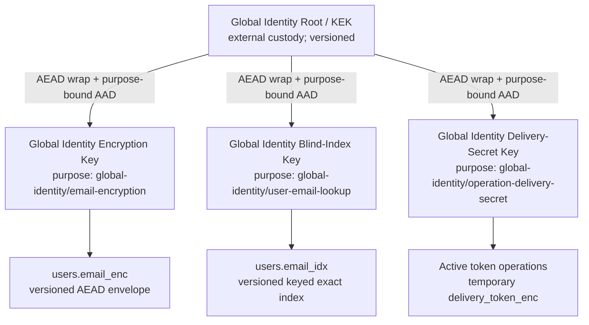
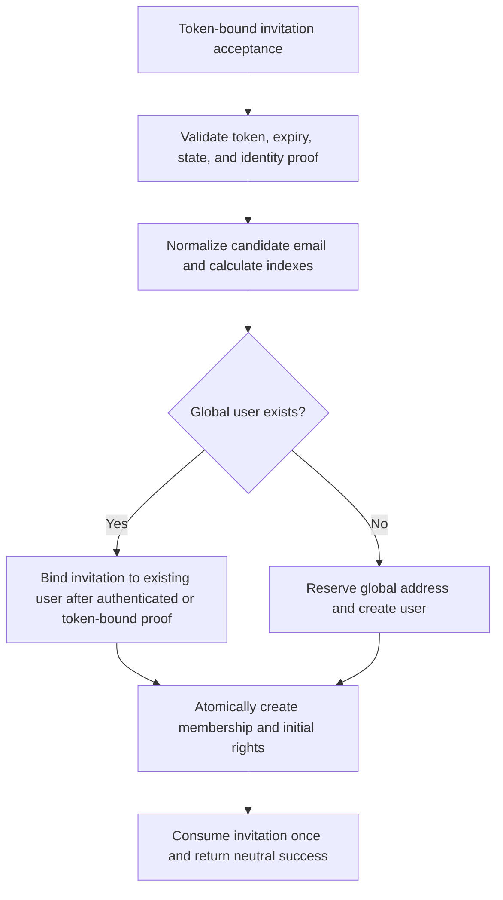

<!--
SPDX-FileCopyrightText: 2026 SecPal Contributors
SPDX-License-Identifier: CC0-1.0
-->

# ADR-015: Global Identity Key Security

**Status:** Accepted

**Date:** 2026-07-20

**Decision authority:** SecPal Product and Domain Owner

**Related:** [ADR-014](20260720-tenant-identity-access-model-adr014.md)

## Relationship to ADR-014

[ADR-014](20260720-tenant-identity-access-model-adr014.md) is accepted and is the binding architectural baseline. It establishes a global user identity, tenant memberships, and a Global Identity Key boundary distinct from tenant data. This ADR only specifies the security design inside that boundary. It neither weakens nor reopens ADR-014.

This ADR is accepted and is the binding security architecture for implementation inside the Global Identity Key boundary established by ADR-014.

## Context

A global identity must be discoverable by an exact email address before a tenant membership is selected. Tenant envelope keys therefore cannot encrypt or index global user identity data: no tenant exists in the authentication context, and the same user may belong to multiple tenants. At the same time, persistent plaintext email creates material disclosure, correlation, phishing, and account-enumeration risk in database dumps, backups, operational logs, and queued payloads.

The design needs an exact, globally unique email lookup without decrypting every user, an authenticated and context-bound ciphertext, independently rotatable encryption and index keys, a practical self-hosted root-key model, and a future path to KMS or HSM custody. It must also define how authentication and identity lifecycle flows stop using plaintext email as a persistent key.

## Current state

The following findings are based on the current `SecPal/api` `main` workspace at commit `3d0d6457689438af4d108d3ca2ae10469cc8fbdd`.

### Current tenant key hierarchy

- `app/Models/TenantKey.php` loads one filesystem KEK from `KEK_PATH`, defaulting to `storage/app/keys/kek.key`, requires 32 bytes and mode `0600`, and refuses insecure or unreadable files.
- Each `tenant_keys` row stores a wrapped random DEK and a separately wrapped random index key, their nonces, and one `key_version`. Binary values are base64-encoded through the custom binary cast into string columns.
- KEK publication uses a cryptographically random libsodium key and an atomic temporary-file plus hard-link procedure. Tenant DEKs and index keys are generated with `sodium_crypto_secretbox_keygen()`.
- Key wrapping and field encryption use libsodium `crypto_secretbox` (XSalsa20-Poly1305) with a fresh random 24-byte nonce. The authentication tag is embedded in the returned ciphertext.
- Blind indexes use binary HMAC-SHA-256 with the tenant index key.
- `app/Casts/EncryptedWithDek.php` persists JSON containing base64 `ciphertext` and `nonce`, resolves `TenantKey` from `tenant_id`, and has no format version, algorithm identifier, key version in the ciphertext, explicit purpose, model/field binding, record binding, or AAD.
- `keys:generate-kek`, `keys:generate-tenant`, and `tenant:setup` provision the existing hierarchy. `keys:rotate-dek` re-encrypts selected `Person` fields before replacing the tenant DEK; it is not resumable and skips malformed records. `keys:rotate-kek` writes a timestamped adjacent backup, replaces the KEK, and then rewraps tenant rows one by one; interruption can leave a mixed state. No implemented command rotates the tenant blind-index key; documentation refers to a rebuild path that does not provide an equivalent key lifecycle.
- Deployment and provisioning documentation treats the filesystem KEK as critical offline-backup material and database dumps as containing wrapped tenant keys. Restore guidance is fragmented and does not provide a version-aware, tested recovery protocol.

This tenant hierarchy is useful implementation evidence, but it is not the Global Identity Key boundary. Global user data must not resolve a `TenantKey` or use `tenant_id` to select cryptographic material.

### Current `APP_KEY` dependency

`APP_KEY` remains a broad Laravel runtime boundary. It protects framework-encrypted values and cookies and is used by the installed MFA package's `encrypted` casts for TOTP shared secrets and recovery-code collections. It also supports other application features such as encrypted form data and application-derived integrity material. Losing or changing it can invalidate sessions and make those encrypted values unreadable.

The existing tenant KEK is a separate file and is not derived from `APP_KEY`. The target global identity hierarchy must likewise be independently rooted. `APP_KEY` may continue to serve framework purposes, but it is neither the sole nor the authoritative Global Identity Key boundary.

### Current global identity and authentication state

- `users.email` is a unique plaintext string. `User` exposes it, uses Laravel email verification, stores a password hash and remember token, owns Sanctum tokens, passkeys, MFA state, and a current `tenant_id` relationship that ADR-014 requires later work to remove.
- Session and token login perform `User::where('email', ...)`, use a dummy password hash for unknown accounts, and return a uniform invalid-credential error. Login rate limits derive cache keys from lowercased, trimmed plaintext input and IP address.
- Password reset looks up users and `password_reset_tokens` by plaintext email. Reset tokens are bcrypt-hashed and single-use under a row lock, but the queued mailable serializes a `User` and plaintext token, and the reset URL contains plaintext email.
- Email verification binds a signed route to `user_id` and a SHA-1 digest of the current email, then calls Laravel's verification helpers. Resend is authenticated.
- No dedicated, step-up-authenticated pending email-change workflow exists. Onboarding can overwrite `user.email`, clear verification, and then mark it verified after invitation-token completion.
- Invitation/onboarding uses a bcrypt token plus an unkeyed SHA-256 lookup hash. The public validation and completion endpoints require token plus plaintext employee email, compare the email case-sensitively, and place both email and token in the invitation URL. Invitation delivery currently sends synchronously.
- MFA login challenges contain only `user_id`, context, and device name in cache. TOTP shared secrets and recovery codes use Laravel encryption under `APP_KEY`; TOTP anti-replay keys contain user-scoped state. MFA audit properties currently include user email.
- Passkey authentication is discoverable and usernameless: cached challenges do not contain email, credential verification resolves the user through stored passkey metadata, and registration is bound to authenticated `user_id` with password step-up. Passkey metadata is plaintext but includes no required email lookup.
- Sanctum personal access tokens are hashed in the database; sessions and remember tokens are user-ID-bound. Logout-all, password reset, lifecycle deprovisioning, and deletion revoke tokens and sessions by `user_id`.
- Mailables and lifecycle services frequently receive full models or raw addresses. Some queued mail therefore risks serializing identity-bearing models; mail delivery failures and activity logs currently include plaintext email.
- Factories, seeders, and authentication, onboarding, MFA, passkey, mail, session, lifecycle, rate-limit, and logging tests construct or assert plaintext `email` fields and queries.

## Assets and classification

| Asset                                              | Classification and required treatment                                                                                                                                                 |
| -------------------------------------------------- | ------------------------------------------------------------------------------------------------------------------------------------------------------------------------------------- |
| Original email                                     | Personal data and authentication identifier; transient plaintext only at validated input, authorized display, or immediate mail delivery boundaries.                                  |
| Normalized email                                   | High-value correlation and lookup material; never persisted or logged in plaintext.                                                                                                   |
| Blind index                                        | Pseudonymous deterministic identifier; confidential metadata subject to equality, frequency, and guessing leakage.                                                                    |
| Password hash                                      | Credential verifier; use the framework's memory-hard/password hashing policy, never encrypt as a substitute for hashing.                                                              |
| Reset, verification, invitation, and change tokens | Bearer credentials; persist a non-decryptable verifier plus a temporary, purpose-bound encrypted delivery copy; bind to one operation, expire, and consume once.                      |
| Invitation addresses                               | Personal data; store encrypted with an invitation-specific purpose or reference an existing `user_id`; do not reuse the user lookup index.                                            |
| MFA secrets                                        | High-impact credentials; encrypt under a dedicated Global Identity credential purpose, not merely `APP_KEY`. Recovery codes remain one-time verifiers.                                |
| Passkey metadata                                   | Authentication metadata, including credential ID, public key, AAGUID, transports, counters, and backup state; protect access and minimize disclosure, but public keys are not secret. |
| Session and access tokens                          | Bearer credentials; persist only established hashes or opaque session state, bind to `user_id`, expire or revoke according to policy.                                                 |
| Global Identity Root/KEK                           | Critical root secret; never store plaintext in the database, application logs, images, or the same backup set as database data.                                                       |
| Encryption keys                                    | Confidential working keys; randomly generated, purpose-bound, versioned, wrapped at rest, and zeroized when practical.                                                                |
| Blind-index keys                                   | Confidential high-value guessing-oracle keys; separate from encryption keys, purpose-bound, versioned, and wrapped at rest.                                                           |
| Key versions and metadata                          | Integrity-sensitive operational metadata; database-backed, audited, backed up, and validated before use.                                                                              |
| Backups                                            | Potentially complete historical disclosure set; encrypted, access-controlled, version-aware, and separated from root-secret backups.                                                  |
| Logs, traces, and error reports                    | Broadly replicated operational data; must contain identifiers, versions, event types, and redacted diagnostics, not plaintext identity data or secrets.                               |

## Threat model

| Scenario                                                 | Required protection and residual risk                                                                                                                                                                                                                                                                                                                                                                                                                                                                                                                                                 |
| -------------------------------------------------------- | ------------------------------------------------------------------------------------------------------------------------------------------------------------------------------------------------------------------------------------------------------------------------------------------------------------------------------------------------------------------------------------------------------------------------------------------------------------------------------------------------------------------------------------------------------------------------------------- |
| 1. Isolated database exfiltration                        | Email ciphertext and wrapped keys do not disclose email without root and working keys. A keyed index prevents direct hashing but still leaks equality, frequency, row relationships, and enables guesses only after index-key compromise.                                                                                                                                                                                                                                                                                                                                             |
| 2. Database and object-storage exfiltration              | The same guarantee applies to encrypted database and object data if root material and runtime secrets are absent. Storage metadata and access patterns may remain visible.                                                                                                                                                                                                                                                                                                                                                                                                            |
| 3. Backup exfiltration                                   | Encrypted database backups remain protected when root-secret backups are separately controlled. Historical ciphertext and index versions increase the attack window.                                                                                                                                                                                                                                                                                                                                                                                                                  |
| 4. Log or error-tracking exfiltration                    | Redaction and identifier-only events prevent logs from becoming a plaintext identity replica. Operational metadata still leaks event timing and user IDs.                                                                                                                                                                                                                                                                                                                                                                                                                             |
| 5. Loss of `APP_KEY`                                     | Global email encryption and lookup remain recoverable because their root is independent. Framework cookies, sessions, current MFA ciphertexts, and other Laravel-encrypted values may fail until separately migrated or recovered.                                                                                                                                                                                                                                                                                                                                                    |
| 6. Global Identity Root compromise                       | An attacker with the database can unwrap all retained global identity keys and decrypt data or compute indexes. Emergency root rotation limits future exposure but cannot undo prior disclosure.                                                                                                                                                                                                                                                                                                                                                                                      |
| 7. Encryption-key compromise                             | Ciphertexts for that key version become readable. Blind indexes remain protected by a separate key. Re-encryption and credential review are required.                                                                                                                                                                                                                                                                                                                                                                                                                                 |
| 8. Blind-index-key compromise                            | Email guesses can be tested offline and matching rows correlated, but ciphertext remains confidential. Re-indexing and abuse review are required.                                                                                                                                                                                                                                                                                                                                                                                                                                     |
| 9. Ciphertext manipulation                               | AEAD authentication plus AAD binding causes a fail-closed integrity error; modified data is never returned or silently repaired.                                                                                                                                                                                                                                                                                                                                                                                                                                                      |
| 10. Offline email-index dictionary attacks               | HMAC prevents testing without the index key. If the index key is stolen, the low-entropy and enumerable nature of many addresses permits guessing; rate limits do not protect an offline attacker.                                                                                                                                                                                                                                                                                                                                                                                    |
| 11. Account enumeration                                  | Login, reset, invitation, verification, and registration endpoints use neutral externally observable responses and comparable work where practical. Internal audits must not expose existence to unauthorized callers.                                                                                                                                                                                                                                                                                                                                                                |
| 12. Concurrent registration                              | Database uniqueness plus transaction-scoped serialization across every accepted index version permits exactly one global identity for a normalized address. Losers receive a neutral conflict outcome.                                                                                                                                                                                                                                                                                                                                                                                |
| 13. Concurrent email change                              | A globally unique pending reservation and row locking permit only one active owner; activation is atomic and stale operations cannot overwrite a newer request.                                                                                                                                                                                                                                                                                                                                                                                                                       |
| 14. Faulty rotation                                      | Versioned keys, resumable checkpoints, authenticated test reads, reference counts, and explicit completion criteria prevent premature key deletion and expose partial progress.                                                                                                                                                                                                                                                                                                                                                                                                       |
| 15. Restore of an old backup                             | The recovery set must retain every key version referenced by the backup. Restore runs isolated, detects the restored rotation epoch, and completes or rolls back the relevant cryptographic phase before serving traffic.                                                                                                                                                                                                                                                                                                                                                             |
| 16. Complete control of the running application process  | Application encryption does not protect plaintext or loaded keys from an attacker controlling the process, debugger, host memory, or authorized decryption path. KMS/HSM custody can reduce key export but cannot stop an authorized compromised process from requesting decryptions.                                                                                                                                                                                                                                                                                                 |
| 17. Permanent loss of all root material                  | Encrypted global identity data and wrapped working keys become permanently unrecoverable. No bypass, default key, or plaintext fallback is allowed.                                                                                                                                                                                                                                                                                                                                                                                                                                   |
| 18. Delivery-Secret-Key compromise                       | An attacker holding an affected key version plus a database or backup copy can decrypt active delivery secrets and expose reset, verification, invitation, and email-change tokens. Re-encryption cannot restore secrecy. Revoke every active or still-valid delivered operation referencing that version, reject its verifier, delete its delivery ciphertext, assign a terminal security-revocation state, rotate the key, and issue a new operation with a new random token only when required. Retain or destroy the compromised version according to backup and incident policy. |
| 19. Delivery-Secret-Key loss without compromise evidence | Undelivered operations referencing the unavailable version cannot be sent. There is no fallback and no reconstruction from `token_hash`. Recover the exact key when safely possible; otherwise terminalize affected operations, audit the outage with redacted metadata, and create new operations with new tokens under an available version when required. Any uncertainty between loss and compromise invokes the stricter compromise response.                                                                                                                                    |

Application-layer encryption primarily protects data at rest from isolated database, storage, backup, log, and snapshot disclosure where root secrets and the live process are not compromised. It does not protect against a fully compromised running process, malicious authorized application behavior, plaintext captured before encryption or after decryption, endpoint compromise, or an attacker holding both the relevant ciphertext and keys.

## Security goals

- Keep persistent global email plaintext and normalized plaintext out of databases, backups, queues, logs, traces, and error payloads.
- Provide exact global identity lookup and database-enforced uniqueness without decryption or full-table scanning.
- Separate global identity from all tenant keys and separate encryption from indexing cryptographically and operationally.
- Authenticate every ciphertext and bind it to its purpose, model, field, record, and format.
- Support independent, resumable, auditable rotation and tested recovery for every key layer.
- Fail closed when key material, versions, context, or ciphertext integrity is invalid.
- Make safe self-hosting practical while preserving a stable wrapping interface for later KMS or HSM custody.

## Non-goals

- Hiding row counts, access patterns, equality, or frequency of exact lookups from a database observer.
- Protecting data from an attacker with complete control of the running application process.
- Supporting fuzzy, substring, domain, or full-text search over email addresses.
- Defining tenant-data encryption, employee-data encryption, or membership authorization beyond the boundary fixed by ADR-014.
- Implementing migrations, compatibility paths, code, secrets, key generation, rotation, or deployment changes in this ADR.
- Treating encryption as a replacement for authorization, TLS, token hashing, password hashing, rate limits, host hardening, or least privilege.

## Binding decision

Global identity data uses a dedicated envelope hierarchy and never a `TenantKey`. `APP_KEY` is not its sole or authoritative root. Encryption and blind indexing use separately generated working keys with explicit purposes and independent versions. Raw working keys are stored only as authenticated wrapped values; raw root material is never stored in the database.

The V1 self-hosted operating model uses a versioned file-based Global Identity Root Provider. It retains one immutable 256-bit random root-key file per root ID/version outside the repository, web root, deployment, and database. The provider loads a root only by its exact recorded ID/version; it does not rely on one implicit current-key file. The application accesses it through a `GlobalIdentityKeyWrapper` boundary. A later implementation may replace the filesystem provider with a KMS/HSM-backed wrap/unwrap provider without changing ciphertext or index consumers.

No custom cryptographic primitive is permitted. Implementations use a maintained, reviewed library and operating-system CSPRNG. Static nonces, unauthenticated encryption, and nonce reuse with the same key are prohibited.

## Key hierarchy



Each key record has a stable key ID, numeric version, purpose, algorithm, lifecycle state, creation/activation timestamps, wrapped key bytes, wrapping nonce, wrapping algorithm, root/KEK ID and version, and non-secret audit metadata. The root derives no working key by reusing raw bytes. Working keys are independently random. If derivation is later required inside an HSM, a standard KDF with distinct, fixed purpose labels and contexts must provide equivalent domain separation.

The minimum purpose labels are:

- `secpal/global-identity/email-encryption/v1`;
- `secpal/global-identity/user-email-lookup/v1`;
- `secpal/global-identity/operation-delivery-secret/v1`;
- distinct labels for invitation addresses, pending email changes, MFA credentials, and any future persistent index.

## V1 user email schema

The logical V1 user schema contains at least:

```text
users.email_enc | users.email_idx | users.email_normalization_version | users.email_idx_key_version | users.email_version
```

`email_enc` contains the encrypted, validated original representation after permitted boundary whitespace removal. `email_idx` contains the keyed blind index of the normalized address. `email_normalization_version` identifies the normalization algorithm, and `email_idx_key_version` identifies the blind-index key. `email_version` is a monotonically increasing business version of the active email assignment and binds reset, verification, and change operations.

The schema contains no persistent plaintext email, no persistent normalized plaintext, no fallback column, no permanent dual write, and no compatibility layer.

## Original and normalized email data flow

V1 strictly separates the display and delivery representation from lookup identity:

```text
raw request input
→ remove permitted boundary whitespace
→ validate the original representation
→ encrypt the validated original representation into email_enc

validated original representation
→ normalizeEmailV1
→ calculate email_idx
```

`email_enc` preserves the user's valid representation, including original local-part case and original international-domain spelling. Lookup normalization never replaces the encrypted original. The original representation may be decrypted only for an explicitly authorized display, immediately before mail delivery, or for a defined security or recovery procedure.

Only `normalizeEmailV1(validated_original)` is indexed. It is never persisted as plaintext.

## Email encryption format

`users.email_enc` is a PostgreSQL `jsonb` authenticated envelope with this logical schema:

```json
{
  "format_version": 1,
  "algorithm": "XCHACHA20-POLY1305-IETF",
  "key_id": "<stable identifier>",
  "key_version": 1,
  "nonce": "<base64url-no-padding>",
  "ciphertext_and_tag": "<base64url-no-padding>"
}
```

Version 1 uses the maintained libsodium XChaCha20-Poly1305-IETF implementation with a 256-bit key, a fresh uniformly random 192-bit nonce for every encryption, and the library's combined ciphertext-and-authentication-tag output. V1 does not split or recombine the tag. Directly preserving the library format reduces parsing, length, ordering, and tag-association errors.

Nonces are generated by the operating-system CSPRNG. Static or deterministic nonces and reuse with the same key are prohibited. V1 does not require a global production nonce-collision registry: with random 192-bit nonces, such a registry would add disproportionate persistence, synchronization, and failure modes. The encryption API must permit an injectable test RNG; tests prove correct nonce length, freshness, and that retries never reuse an earlier nonce. An observed collision or reuse is a security incident and blocks the affected operation.

The AEAD additional authenticated data is the UTF-8 encoding of a fixed, unambiguous, versioned context containing:

```text
format_version = 1 | algorithm = XCHACHA20-POLY1305-IETF | key_purpose = secpal/global-identity/email-encryption/v1 | key_id = envelope key identifier | key_version = envelope key version | model_type = user | field_name = email_enc | record_id = canonical lowercase UUID
```

The implementation uses the field order above and an unambiguous length-delimited canonical encoding. It never uses implicit language-object or JSON serialization. Stable test vectors define the encoding. AAD is reconstructed from fixed constants, record context, and envelope key metadata rather than accepted as trusted stored input. Moving ciphertext to another user, record, field, model, purpose, algorithm, key ID, key version, or format fails authentication.

Wrapped working keys use the same principle. Their canonical AAD contains, in fixed order, at least:

```text
wrapping_format_version | wrapping_algorithm | working_key_purpose | working_key_id | working_key_version | root_key_id | root_key_version
```

This AAD also uses explicit length encoding and stable test vectors.

Unknown formats, algorithms, or key versions; invalid base64url; wrong nonce or tag lengths; missing fields; extra security-relevant ambiguity; incorrect AAD; and failed authentication all fail closed. No caller receives partial plaintext, and no fallback key or legacy plaintext lookup is attempted.

## Email normalization

V1 supports ASCII local parts and internationalized domains through IDNA. It defines case-insensitive global identity but does not accept internationalized Unicode local parts and therefore does not require SMTPUTF8.

All lookup, uniqueness, and normalized comparison flows use exactly one `normalizeEmailV1` implementation. Version 1 performs these steps in order:

1. Require valid UTF-8 input.
2. Remove Unicode `White_Space` code points only at both outer boundaries.
3. Do not alter interior whitespace; reject rather than silently repair invalid interior whitespace.
4. Require exactly one structural ASCII `@` with non-empty local part and domain.
5. Reject quoted local parts, comments, and obsolete RFC syntax.
6. Require the complete local part to be ASCII.
7. Lowercase ASCII letters in the local part with a locale-independent mapping.
8. Preserve dots exactly.
9. Preserve plus suffixes exactly.
10. Apply no provider-specific alias rule or heuristic identity merge.
11. Process the domain with UTS #46 non-transitional IDNA and STD3 rules.
12. Reject every IDNA error.
13. Emit the domain as lowercase ASCII A-labels.
14. Reject a trailing root dot rather than removing it.
15. Enforce DNS-independent syntax limits: local part at most 64 ASCII octets, every domain label at most 63 ASCII octets, domain at most 253 ASCII octets, and the complete normalized address at most 254 octets.
16. Return a generic validation error for invalid input and neither look it up nor persist it.

The output is:

```text
lowercase_ascii_local_part + "@" + lowercase_ascii_idna_domain
```

This policy provides predictable case-insensitive identity while retaining international domains. Self-hosted relays do not reliably support SMTPUTF8, and syntax validation alone cannot guarantee SMTPUTF8 delivery. An accepted address must remain usable for verification, password-reset, and security mail. A later EAI/SMTPUTF8-capable format requires a new normalization version, collision analysis, controlled re-indexing, global reservations, and an explicit architecture decision about changed identity equivalence.

Normalization behavior is versioned independently from ciphertext, encryption-key, and index-key versions.

## Blind-index design

For user lookup:

```text
email_idx = HMAC-SHA-256(user_email_lookup_index_key, canonical_encode(purpose, normalization_version, normalized_email))
```

- The HMAC key is the active, independently random Global Identity Blind-Index Key for purpose `secpal/global-identity/user-email-lookup/v1`.
- The HMAC input uses that exact purpose, the explicit normalization version, and `normalizeEmailV1(validated_original)`, in fixed order with unambiguous length encoding. It never uses implicit language-object or JSON serialization.
- `users.email_idx` is PostgreSQL `bytea`, exactly 32 bytes. It is never hex or base64 text in the database.
- `users.email_normalization_version` and `users.email_idx_key_version` are non-null and independent. A unique constraint covers the active lookup representation; rotation metadata additionally enforces uniqueness for every accepted pair.
- Comparisons use database binary equality. Any application comparison outside the database uses a maintained constant-time comparison function.
- Exact lookup calculates candidate HMACs for the small, explicit set of accepted lookup-version pairs and queries indexed binary values. It never decrypts for search and never scans or decrypts the user table.
- Writes use only the designated write version, except that a time-limited cryptographic index rotation records both required version representations in the rotation structure described below. This is not a compatibility layer with plaintext or an old product model.

The logical lookup identity is:

```text
normalization_version | index_key_version | email_idx
```

An accepted lookup version is the pair `(normalization_version, index_key_version)`. The accepted-read set and write version are explicit pairs. Users, rotation reservations, pending email changes, registrations, invitation acceptance that creates a user, global uniqueness checks, advisory-lock inputs, recovery, and restore all carry or derive the complete pair.

A normalization change is not a key rotation. It changes possible identity equivalence and therefore requires collision analysis, global reservations, controlled re-indexing, and an explicit architectural decision.

The index necessarily leaks equality: equal normalized emails under the same purpose and key version produce equal values. It also leaks frequency if duplicate-capable datasets use the same purpose. The unique user index suppresses duplicate row frequency but still reveals equality checks and correlations with access patterns. HMAC prevents a database-only attacker from computing guesses; it does not prevent offline dictionary attacks after the index key is compromised. Email addresses have limited entropy and are often enumerable, so index-key custody, purpose separation, rotation, breach response, and data minimization remain essential.

### Concurrency and global uniqueness

Registration, invitation acceptance that creates a user, and email activation run in a database transaction. They compute candidate indexes for every accepted `(normalization_version, index_key_version)` pair, acquire transaction-scoped advisory locks derived from the complete versioned binary candidates in a stable order, check both active user rows and reservations, and then insert or activate. Database unique constraints are the final guard. A conflict returns a neutral response and never reveals whether the winner is an existing account, pending registration, or pending email change.

## Index purpose separation

The user lookup index is not reused across tables. Reuse would let a database-only attacker correlate the same address across user, invitation, reset, and security-event datasets.

| Purpose                                 | Persistent representation                                                                                                                                                                                               |
| --------------------------------------- | ----------------------------------------------------------------------------------------------------------------------------------------------------------------------------------------------------------------------- |
| User login and global uniqueness        | `users.email_idx` with the user-lookup purpose and version; required.                                                                                                                                                   |
| Invitations for an existing user        | Store `user_id`, token verifier, and temporary encrypted delivery token; do not store another email index. Resolve the delivery address at send time.                                                                   |
| Invitations for a not-yet-existing user | Store authenticated address ciphertext under an invitation purpose plus the verifier and temporary encrypted delivery token. An optional deduplication index uses an invitation-specific purpose, never the user index. |
| Pending email change                    | Store encrypted candidate address, purpose-specific global uniqueness reservation, token verifier, and temporary encrypted delivery token. Recipient and token ciphertexts use separate purposes and contexts.          |
| Password reset                          | Store `user_id`, `email_version`, token verifier, temporary encrypted delivery token, lifecycle timestamps, and delivery state. No email value or email index is stored.                                                |
| Email verification                      | Bind the verifier and temporary encrypted delivery token to `user_id` plus the current email version, or to a concrete pending-change operation. No email lookup field is stored.                                       |
| Rate limiting                           | Use HMAC of normalized input under a short-lived rate-limit purpose key plus IP/scope as needed, or `user_id` after lookup. Never place plaintext or a reusable database index in cache keys.                           |
| Security events                         | Store `user_id` when known and a non-reversible event-scoped correlation identifier when unknown. Do not store email, normalized email, or the persistent user index.                                                   |

## Asynchronous operation-token delivery

Every mail-based bearer-token operation stores two separate representations of the same cryptographically random token:

```text
token_hash
delivery_token_enc
```

`token_hash` is the only verification representation. It uses a maintained strong token-hash or keyed-verifier facility, is not decryptable, and follows the operation's consumption, expiry, revocation, cancellation, and supersession lifecycle. No verification path decrypts or compares `delivery_token_enc`.

`delivery_token_enc` contains exactly the generated plaintext token and exists only so an asynchronous worker can render the authorized link. V1 encrypts it under an independently random, root-wrapped, independently versioned Global Identity Delivery-Secret Working Key with purpose `secpal/global-identity/operation-delivery-secret/v1`. The key is separate from the email-encryption key, blind-index key, every `TenantKey`, and `APP_KEY`. The operation type is authenticated in AAD rather than selecting a shared cross-purpose ciphertext context.

### Delivery-secret envelope and context

Delivery secrets use the established V1 AEAD envelope:

```json
{
  "format_version": 1,
  "algorithm": "XCHACHA20-POLY1305-IETF",
  "key_id": "<stable identifier>",
  "key_version": 1,
  "nonce": "<base64url-no-padding>",
  "ciphertext_and_tag": "<base64url-no-padding>"
}
```

The canonical, fixed-order, length-delimited AAD contains at least:

```text
format_version
algorithm
key_purpose
key_id
key_version
operation_type
operation_id
user_id_or_null
email_version_or_null
invitation_id_or_null
tenant_id_or_null
```

Every optional value has an explicit canonical absent encoding distinct from an empty value. IDs use their canonical representations. For invitations, `operation_id` equals the canonical `invitation_id`, and `user_id_or_null` represents `intended_user_id_or_null`. AAD is reconstructed from trusted operation context and envelope key metadata. Moving a delivery secret to another operation type, operation, user, email version, invitation, or tenant fails authentication.

After `delivery_token_enc` is created, these AAD-bound operation values are immutable:

```text
operation_type
operation_id
user_id_or_null
email_version_or_null
invitation_id_or_null
tenant_id_or_null
```

Changing any binding value requires this transition:

```text
terminalize old operation
→ delete old delivery secret
→ generate new random token
→ create new operation/envelope with new AAD
```

Delivery status, attempt, and lease fields may change according to the lifecycle because they are not cryptographic AAD inputs. They cannot be used to reinterpret or move an existing envelope.

### Shared delivery lifecycle and state

Every token operation first follows this creation lifecycle:

1. Generate a cryptographically random bearer token.
2. Store its non-decryptable verifier as `token_hash`.
3. Store the exact same plaintext token as purpose-bound, authenticated `delivery_token_enc`.
4. Commit the operation, hash, encrypted delivery secret, and initial delivery state atomically; if any part fails, persist none of them.
5. Queue only the operation ID. Never serialize the token, recipient, delivery envelope, or a full model snapshot.

Token verification always uses only `token_hash`; delivery never changes that rule. Expiry, revocation, consumption, cancellation, or supersession terminalizes the operation, invalidates the verifier, and deletes `delivery_token_enc` according to the point-of-no-return rules below.

The logical delivery status contains at least:

```text
delivery_state
delivery_attempt_id
delivery_fence_version
lease_expires_at
transport_idempotency_key
provider_message_reference
dispatch_committed_at
delivered_at
delivery_attempt_count
last_delivery_error_class
```

The state machine semantically distinguishes `pending`, `claimed`, `dispatch_committed`, `delivered`, `retryable_failed`, `delivery_unknown`, and `terminal`; exact enum names are implementation details. `delivery_attempt_id` is a unique random identifier for one claim. `delivery_fence_version` increases monotonically whenever a claim is created, replaced, expired, or invalidated. `lease_expires_at` bounds the claim. `last_delivery_error_class` is an allowlist-based redacted code and contains no recipient, token, URL, exception message, or ciphertext content.

For V1, `transport_idempotency_key` consists of exactly 32 independently generated operating-system CSPRNG bytes, providing a 256-bit random value before encoding. There is no 128-bit fallback. The 32 random bytes are generated exactly once during the claim transaction, stored atomically with `delivery_attempt_id`, and immutable for that attempt. Every new attempt receives new independent 32 CSPRNG bytes. Reuse is permitted only for an explicitly provider-supported idempotent repetition of the same attempt using the exact stored value.

The 32 random bytes are the canonical internal form. V1 encodes them for provider use as unpadded Base64url without truncation, producing an opaque 43-character value. Encoding does not change the entropy requirement, and no truncation step is permitted. A provider that cannot accept the complete 43-character V1 representation is incompatible with the V1 idempotency-key mechanism: it must receive no weakened or shortened key and instead uses the existing no-provider-idempotency `delivery_unknown` and reconciliation policy.

The idempotency key is never derived from or constructed with an email address, token, user ID, tenant ID, operation ID, attempt ID, or other business identifier, and its external representation exposes no internal ID. Binding to the operation and attempt comes only from the atomic database association. The value is correlation metadata, not an authentication or security secret, but it is handled confidentially: normal logs and audits contain only an internal reference or a shortened keyed or cryptographic digest, never the complete value.

`provider_message_reference` is optional and has a separate meaning. It stores only an opaque identifier actually returned by the provider when that identifier is required for an authoritative status query or reconciliation. It contains no email address, token, complete URL, rendered message, or internal business identifier; it is stored with restricted access and omitted from normal logs. Audit and monitoring use only an internal reference or digest. Transports without a queryable provider reference leave it absent. An RFC Message-ID is not automatically authoritative evidence of provider acceptance or delivery. The provider reference identifies provider-side state; the idempotency key controls supported repetition of one application attempt. They are never substituted for one another.

No database transaction or row lock may remain open during template rendering that has external dependencies, an SMTP or mail-provider API call, transport-status lookup, or any other external I/O. Database state cannot atomically commit with an external mail system, and a transport can accept a message even when the client observes a timeout or crashes. Holding a lock across that boundary would block lifecycle transitions, consume database connections, increase deadlock and availability risk, and still would not eliminate ambiguous or duplicate external handoffs.

### Phase 1: Claim

In one short database transaction, the worker locks the operation and verifies that it remains active, unexpired, unconsumed, not revoked, not cancelled, and not superseded, and that its bound user and optional `email_version` remain current. It creates a new unique `delivery_attempt_id`, independently generates exactly 32 operating-system CSPRNG bytes for `transport_idempotency_key`, stores both atomically, increments `delivery_fence_version` and `delivery_attempt_count`, records a bounded lease, and changes the state to `claimed`. It then commits and releases every row lock. Only one current, unexpired claim may proceed.

### Phase 2: Preparation

Outside any database transaction, the claimed worker authenticates and decrypts `delivery_token_enc`, authenticates and decrypts or resolves the authorized recipient, applies transport canonicalization, and renders the message. Rendering that uses templates, storage, localization services, or any other external dependency also occurs without a database transaction or row lock. Plaintext token, complete URL, recipient, and rendered sensitive content remain only in the smallest practical memory scope and are discarded on every failure.

A preparation failure invokes no transport. A short status transaction verifies the current attempt and fence, then records an allowlisted retryable or terminal outcome, clears the lease as applicable, and retains `delivery_token_enc` only when policy permits a controlled retry. Authentication, recipient, or key failures remain fail-closed.

### Phase 3: Final fence and dispatch commitment

Immediately before external transport, the worker opens a new short transaction, reacquires the operation row lock, and atomically verifies:

- its `delivery_attempt_id` is still the current attempt;
- `lease_expires_at` has not passed;
- `delivery_fence_version` equals the version captured by the worker;
- `delivery_state` is still `claimed`;
- the operation remains active, unexpired, unconsumed, not revoked, not cancelled, and not superseded;
- no terminal lifecycle transition has committed;
- the bound `email_version`, when present, is still the user's current version.

If every check succeeds, the same transaction sets:

```text
delivery_state = dispatch_committed
dispatch_committed_at = now
```

The transaction must commit and release every row lock before the worker invokes the transport. A failed final fence creates no dispatch commitment, invokes no transport, discards prepared plaintext, applies the current lifecycle to the delivery secret in a short transaction where needed, emits only redacted audit metadata, and never automatically reuses the stale claim.

`dispatch_committed` is the point of no return: the application has durably authorized this exact attempt to cross the external boundary, but cannot transactionally control whether the provider accepts, rejects, duplicates, delays, or loses the message. A worker may call the transport only after observing its committed `dispatch_committed` state and matching attempt and fence. An expired, replaced, or stale worker cannot dispatch later.

### Phase 4: External transport

The worker calls SMTP or the mail-provider API without an open database transaction or row lock. It supplies the stored `transport_idempotency_key` only when the provider explicitly supports idempotency for the operation. Only the recipient, rendered message, and other immediately required values cross the transport boundary; logs, exception contexts, failed-job payloads, and transport metadata contain no plaintext token, complete URL, recipient address, decrypted delivery ciphertext, complete idempotency key, or provider message reference.

Provider idempotency reduces duplicate acceptance but does not redefine token validity or make the database and provider atomic. If the provider returns a usable opaque reference, the application stores it as `provider_message_reference` in a short result transaction. The application never invents a provider reference or treats a generic SMTP Message-ID as authoritative status evidence.

### Lifecycle invalidation around the point of no return

Before `dispatch_committed`, a revocation, consumption, expiry, cancellation, supersession, or bound-email-version change increments or otherwise invalidates the fence, prevents the dispatch commitment, terminalizes the operation as applicable, invalidates `token_hash`, and deletes `delivery_token_enc`. This guarantees that no later transport call is authorized for that claim.

After `dispatch_committed`, the physical message may already be in transit and cannot be guaranteed to be recalled or prevented. A lifecycle invalidation must nevertheless immediately invalidate `token_hash`, terminalize the operation, delete any remaining `delivery_token_enc`, prevent token consumption, and write a redacted audit event. A message that arrives after invalidation therefore contains an unusable link. The ADR makes no claim that post-commit invalidation prevents physical delivery.

### Transport result and reconciliation

After confirmed provider acceptance, a short transaction verifies the current attempt and that no terminal lifecycle transition has superseded it, sets `delivery_state = delivered` and `delivered_at`, deletes `delivery_token_enc`, clears the lease and temporary claim fields, and records a redacted success event. A late result never reactivates or overwrites a terminal operation; it is recorded only as a redacted provider outcome. `token_hash` remains only for the operation's permitted consumption lifecycle.

After a confirmed failure before provider acceptance, a short transaction verifies the current attempt and that no terminal lifecycle transition has superseded it, then sets `delivery_state = retryable_failed` or a terminal state according to the allowlisted error class. It clears the lease and retains the delivery secret only when a controlled retry is allowed. A late failure cannot reopen a terminal operation. Retry metadata contains no sensitive plaintext.

A client timeout, process crash after possible provider acceptance, network interruption without an authoritative response, or any other ambiguous handoff sets or reconciles the attempt to `delivery_unknown`. Reconciliation follows this binding order:

1. Query authoritative provider status through `provider_message_reference` when the provider supports that operation and the reference is present.
2. Otherwise query by the stored `transport_idempotency_key`, or repeat the same attempt with that exact stored key, only when the provider explicitly supports authoritative lookup or idempotent repetition by that key.
3. Without authoritative provider evidence, keep the attempt `delivery_unknown`.
4. Never perform a blind automatic resend.
5. If a new business delivery is required, terminalize the uncertain operation as policy requires and create a new operation with a new random token, attempt, and idempotency key.

SMTP alone does not generically provide authoritative status lookup or idempotency. A transport or provider without those documented capabilities remains fail-closed in `delivery_unknown`; absence of `provider_message_reference` never triggers an automatic resend.

A reconciler processes expired `claimed` states, hanging `dispatch_committed` states, `delivery_unknown`, authoritative provider status available through provider references or idempotency keys, and terminal operations that retain ciphertext. It can mark an evidenced outcome delivered, retryable, unknown, or terminal and clean residual ciphertext. It cannot reconstruct a token or create a replacement operation unless the explicit business workflow authorizes that new operation.

## Login flow


The plaintext input exists only for the request. Login uses indexed lookup, preserves uniform invalid-credential responses and comparable password-hash work, and does not decrypt email to authenticate. Successful presentation may decrypt the address only when an authorized response actually needs it. Membership selection and authorization occur after global authentication as required by ADR-014.

Passkey discovery remains email-independent and resolves `user_id` from credential metadata. MFA challenges remain `user_id`-bound. Rate-limit and audit changes must remove plaintext email without weakening existing anti-enumeration behavior.

## Invitation and registration



- Invitation creation chooses `user_id` when an identity already exists. Otherwise it stores only invitation-purpose address ciphertext. Every invitation operation stores the single-use verifier as `token_hash` and the temporary encrypted token as `delivery_token_enc`.
- Public request and repeat/replay failures are neutral. Possession of an address alone never confirms account existence.
- Acceptance is bound to the invitation token and its intended operation. Identity proof and mailbox verification rules remain explicit; an invitation token is consumed exactly once.
- User creation, global-address ownership, membership, initial rights, and invitation consumption are atomic. A parallel or repeated acceptance either observes the committed result idempotently where safe or returns the same neutral conflict/failure response.
- Queued invitation work contains only `invitation_id`, not plaintext email, token, delivery envelope, or a full model snapshot. Invitation delivery-secret AAD binds `operation_type = invitation`, `invitation_id`, `tenant_id`, and `intended_user_id_or_null`. The worker decrypts the intended address and token only at the delivery boundary. Later acceptance verifies only `token_hash` and the invitation lifecycle rules.

## Password reset

The preferred persistent model is:

```text
user_id
email_version
token_hash
delivery_token_enc
expires_at
created_at
delivered_at
consumed_at
```

The reset-request endpoint normalizes and indexes the submitted email, resolves `user_id`, performs equalized work for missing accounts, and returns one neutral response. The operation captures the user's current `email_version` and stores no email or email index. The queue contains only the reset-operation ID. Immediately before delivery, the worker rechecks that `email_version` is still active, decrypts the current recipient and delivery token, and renders the link. A stale operation does not send to an address replaced after the request. Successful transport handoff deletes `delivery_token_enc`, not `token_hash`.

Reset consumption locks the operation, checks that its `email_version` remains current, checks expiry and only `token_hash`, changes the password, consumes all outstanding reset operations, clears the defined credentials and remember state, and revokes sessions and access tokens atomically. Email activation atomically revokes every reset operation bound to an older email version and deletes its delivery secret. Tokens are strongly verified, expiring, and single-use; replay and parallel consumption permit one winner.

## Email verification

Active-email verification is bound to exactly:

```text
user_id
email_version
verification_operation_id
token_hash
delivery_token_enc
```

Alternatively, candidate-address verification binds to one explicit pending email-change operation. The operation stores the verifier in `token_hash` and its temporary delivery copy in `delivery_token_enc`; the token expires and is consumed once. The verification URL needs an opaque operation identifier and token, not email. A signature derived from plaintext email is not the identity binding, and verification uses only the hash.

Verification of the active address updates only that exact email version. Verification of a pending address binds delivery-secret AAD to the concrete email-change operation and does not mutate the active address until activation succeeds. Its queue contains only the verification-operation ID or, for a pending change, only the change-operation ID. Resend creates a new operation or new token and unambiguously revokes or supersedes the prior operation, deletes its delivery secret, and prevents stale delivery.

## Email change

The pending operation stores:

```text
operation_id
user_id
operation_version
candidate_email_enc
normalization_version
index_key_version
candidate_email_idx_reservation
token_hash
delivery_token_enc
expires_at
```

1. Require recent step-up authentication using password plus MFA/passkey according to account policy.
2. Validate and preserve the candidate's original representation, normalize it, reject a no-op against the current address, calculate indexes for every accepted lookup-version pair, and reserve global uniqueness under transaction-scoped locks.
3. Persist the candidate only as purpose-bound authenticated ciphertext in a pending operation with expiry, requester `user_id`, monotonically increasing operation version, explicit normalization and index-key versions, reservation, and hashed verification token. The candidate encryption purpose is separate from the active user-email purpose. Never replace the active email before verification.
4. Queue only the pending operation ID. The worker decrypts `candidate_email_enc` only as the immediate recipient and decrypts `delivery_token_enc` only immediately before link rendering. The two ciphertexts use separate key purposes and AAD contexts. Send a security notification to the old active address without placing either address in logs or job payloads.
5. On token consumption, lock the user and pending reservation, recheck uniqueness across accepted lookup-version pairs, and atomically write the candidate original representation to `email_enc`, activate its `email_idx` and independent versions, increment `email_version`, mark that version verified, release the old index, consume competing pending operations, and record an audit event.
6. Atomically revoke password-reset and email-verification operations bound to the replaced email version, delete their delivery secrets, and revoke remember tokens, sessions, and access tokens according to the credential-revocation policy. Require fresh login unless the accepted product policy explicitly preserves the initiating session.
7. Concurrent changes for one user use a monotonically increasing operation version; only the latest active operation may win. Concurrent claims by different users are serialized by the global reservation protocol.

Cancellation, expiry, failure, or lost-key conditions release reservations safely and leave the old active email unchanged.

## Mail decryption boundary

Email is decrypted only immediately before handing a recipient address to the mail transport or rendering an authorized response that requires it. Delivery workers receive only the applicable operation ID. Persistent queue payloads, failed-job tables, retry metadata, exception contexts, and monitoring events must not contain plaintext email, normalized email, delivery envelopes, decrypted model snapshots, complete tokens, or complete delivery URLs.

`email_enc` preserves the validated original representation for authorized display. Immediately before transport, a separate deterministic transport-canonicalization function converts the already validated domain to its lowercase ASCII A-label representation while preserving the validated original spelling and case of the ASCII local part. Transport canonicalization is not lookup normalization and is never persisted as a second email value. It neither lowercases the local part nor changes dots or plus suffixes.

For token mail, the worker decrypts the recipient and delivery token only after it has successfully claimed and revalidated the operation. Those plaintext values may exist only during link rendering and the immediate transport invocation. Neither value is written back to the operation, job, failure record, audit event, API response, trace, or exception context.

Mail delivery fails closed if the required key or ciphertext cannot be authenticated. The system records a redacted delivery failure keyed by operation ID, user ID where known, key version, and error class. It does not fall back to a plaintext column or guess another recipient.

## Versioned self-hosted root provider

V1 uses a versioned file-based root provider:

```text
Global Identity Root Provider
├── root version 1
├── root version 2
└── retained historical versions
```

The provider manages multiple Root/KEK versions concurrently and loads a root only by its exact recorded ID and version. It has no implicit global `current key` file. It never overwrites an old root, publishes a new version atomically, supports one write-active version alongside recovery-retained historical versions, and fails closed when a requested version is unavailable. Registry metadata selects the write-active root version; renaming or replacing a root file does not. The provider interface permits a later KMS/HSM implementation without changing envelope semantics.

The recommended file-based execution uses a dedicated root-key directory outside the repository, deployment, webroot, and database. It stores one immutable regular file per root version, containing exactly 32 random bytes. The operating account exclusively owns and can access the directory; group and world permissions are absent. Root files use mode `0600` or stricter. The provider rejects symlinks, non-regular files, insecure ownership or permissions, unexpected length, and missing exact versions. Provisioning creates and publishes a new file atomically without overwrite. Runtime processes receive read access only where practical; a separately authorized operational process provisions and rotates roots. Exact filenames and configuration-key names remain implementation details.

## Rotation

All rotations require an approved operation ID, current backups and recovery test, healthy key registry, no unresolved integrity errors, capacity monitoring, and an audit sink that does not contain secrets. A rotation is a state machine with durable checkpoints and idempotent batches.

### Encryption-key rotation

1. Create and wrap a new encryption-key version; verify unwrap and test-vector encryption before activation.
2. Mark it `write-active`. New writes use it; reads select the exact version in each envelope and continue accepting retained read versions.
3. Re-encrypt batches with row locks or compare-and-swap on ciphertext/version. Each batch authenticates old AAD, decrypts in memory, encrypts with a fresh nonce and the same record-bound AAD, commits, checkpoints, and audits counts without values.
4. Resume from durable checkpoints after interruption. Failed records remain on the old readable version and block completion.
5. Completion requires zero references to old versions, full integrity sampling or verification, successful backup/restore rehearsal, and reconciled counts.
6. Mark old keys decrypt-only, then retired. Delete wrapped old keys only after all live data and every retained backup no longer references them and policy authorizes destruction. Rollback can return writes to the old key only before new-only data or key destruction makes that unsafe.

### Delivery-secret-key rotation

1. Create, wrap, verify, and activate a new Delivery-Secret Working Key version. New operations use it; workers select the exact version in each active envelope.
2. Either re-encrypt every active, undelivered `delivery_token_enc` in resumable authenticated batches with fresh nonces and unchanged operation-bound AAD context, or retain the old version as readable until all such operations become delivered or terminal.
3. Re-encryption locks and revalidates the operation, decrypts only in memory, writes the replacement envelope atomically, and never changes `token_hash` or queues a delivery.
4. Completion requires no active delivery envelope referencing the old version, reconciled counts, successful retry and restore tests, and confirmation that retained backups can still restore every referenced version.
5. Retire or destroy an old key only after no live delivery secret and no relevant retained backup refers to it.

Re-encryption of existing delivery tokens is allowed only for planned or non-compromise rotation. It is prohibited as the sole response to suspected or confirmed Delivery-Secret-Key compromise.

### Delivery-secret compromise and loss response

Operations retain their non-secret Delivery-Secret Key ID/version metadata after `delivery_token_enc` is deleted, through token validity and incident-retention windows. This permits identification of already delivered but still-valid tokens by the key version that protected their delivery copy.

Suspected or confirmed compromise uses this mandatory sequence:

```text
revoke old operations
→ invalidate old token hashes
→ delete old delivery ciphertext
→ rotate key
→ create new operation and new random token when required
```

Incident response inventories every live operation and retained backup that references the affected version and immediately blocks new writes with it. It terminally marks every active or already delivered but unconsumed and still-valid operation as security-revoked, makes its `token_hash` unacceptable, deletes any remaining `delivery_token_enc`, and never reuses or merely re-encrypts the token. Required replacement work creates a wholly new operation, random token, verifier, envelope, and AAD under an uncompromised version; each replacement records the incident reference without token, email, or ciphertext. The compromised key is rotated and retained, quarantined, or destroyed according to backup retention and incident policy. Abuse monitoring covers reset, verification, invitation, and email-change endpoints and token-consumption attempts.

Loss without evidence of compromise fails delivery closed for every undelivered operation referencing the unavailable version. There is no fallback key and no token reconstruction from `token_hash`. If authorized recovery of the exact key is impossible, affected operations enter a terminal key-unavailable state, delete residual delivery ciphertext where possible, and are recreated with new random tokens under an available version only when still required. The outage audit contains only redacted operation and key metadata. Any uncertainty whether the key was lost or compromised invokes the stricter compromise response.

### Blind-index-key rotation

1. Create, wrap, and verify a new index-key version. Keep the old version accepted for reads.
2. Keep `normalization_version` unchanged for a pure key rotation. Create a time-limited cryptographic rotation structure holding `(user_id, normalization_version, index_key_version, email_idx, rotation_state)` with unique constraints over the complete versioned lookup identity. It contains no plaintext.
3. For each user, decrypt `email_enc`, normalize, compute old and new indexes, verify the old value, and persist the new reservation in an idempotent transaction.
4. During rotation, accepted reads and writes use the explicit set of `(normalization_version, index_key_version)` pairs. Registrations and email changes calculate every accepted representation, acquire locks in stable order, check both user rows and reservations, and reserve every representation so global uniqueness holds across old-only, new-only, and migrated rows.
5. After every user has a verified new reservation, atomically or in guarded batches move the new value/version into `users.email_idx`; writes continue to maintain both representations until cutover completes.
6. Completion requires one verified new index per user, no duplicates or unresolved collisions, no old-version-only rows, successful login and concurrency tests, and a recovery checkpoint. Then stop old-version writes, remove old rotation entries, and retire the old key subject to backup retention.

This dual-index interval is an explicitly time-limited cryptographic rotation phase. It is not a plaintext dual write, a legacy product compatibility layer, or permission to retain a permanent second identity model.

### Root/KEK rotation

1. Provision and verify a new root version separately without replacing, renaming, or modifying the old root version.
2. Open each wrapped working key with its exactly recorded root ID/version, then wrap the unchanged working key with a fresh nonce, authenticated wrapping AAD, and the new root ID/version.
3. Store old and new wrapped envelopes transactionally or through a versioned registry so interruption never makes a key unreadable. Registry metadata, not a global implicit current file, selects the write-active root version.
4. Checkpoint and resume until all working keys and retained metadata reference the new root. Test restore paths requiring the old root and the new root, as well as mixed in-progress registry state.
5. Deactivate the old root for writes but retain it unchanged while active data or any retained backup references it. Destroy it only after exhaustive reference and retention review. Rollback remains possible while both root versions and their registry envelopes remain available.

### Emergency rotation

Suspected compromise freezes discretionary key changes, preserves evidence, identifies affected versions and time windows, restricts access, and invokes the incident-response owner. Rotate the compromised layer and every descendant whose confidentiality can no longer be trusted. A root compromise requires new root custody and rewrapping/rotating descendants according to exposure analysis; an encryption-key compromise requires re-encryption; an index-key compromise requires re-indexing and account-abuse monitoring.

A Delivery-Secret-Key incident additionally inventories all operations and backups referencing the affected version, immediately blocks new writes with it, and revokes both active and already delivered but unconsumed and still-valid operations. Existing tokens are never reused; replacements are new operations with new random tokens and incident references. Monitor reset, verification, invitation, and email-change request and consumption endpoints for abuse. Audit operation IDs, key versions, state transitions, counts, and incident references without token, email address, delivery ciphertext, or complete URL.

Assume already exfiltrated plaintext cannot be recovered by rotation. Record incident and rotation IDs, version transitions, counts, and decisions without secrets.

## Backup and recovery

- Database backups include ciphertext, active `delivery_token_enc` values, blind indexes, normalization and key versions, delivery/rotation state, checkpoints, key IDs, root IDs/versions, purposes, algorithms, lifecycle states, and authenticated wrapped working keys.
- Every retained Global Identity Root/KEK version required by active data or a retained backup is backed up separately from database and object-storage backups, encrypted under an independent recovery control, stored in a different security and failure domain, and accessible only to explicitly authorized recovery roles. No real key value belongs in documentation.
- Backup systems use least privilege, encryption in transit and at rest, immutable or append-protected retention where practical, access audit, and regular restore sampling.
- Restore order is: isolate the environment; inventory database key references and rotation epoch; obtain the exact required root versions through recovery authorization; restore key-provider access; restore database and storage; verify wrapped-key and ciphertext authentication; resume or reconcile interrupted rotations; run integrity, uniqueness, login, and mail-boundary checks; then permit traffic.
- Restoring a backup created before or during rotation requires every root, encryption, and index version it references. The restored system must not silently use only today's write key or delete historical versions.
- Every Delivery-Secret Working Key version remains recoverable through the end of each referencing operation and relevant backup retention. Expired, revoked, consumed, cancelled, superseded, or delivered operations have no recoverable delivery secret after lifecycle cleanup.
- Restore keeps all restored token-delivery operations quarantined until it reconciles them with a separately retained, append-protected terminal-operation journal newer than the database backup. That journal contains only operation IDs, terminal state, key ID/version, incident reference where applicable, and timestamps, never tokens, addresses, or ciphertext. Delivered or otherwise terminal operations are tombstoned and have any restored delivery secret deleted. Restored `dispatch_committed`, `delivery_unknown`, and other attempts without an authoritative outcome remain quarantined and are never automatically resent.

The journal provides a verifiable completeness boundary containing at least:

```text
backup_epoch
journal_sequence
journal_checkpoint
```

The restore process authenticates the checkpoint and proves uninterrupted sequence continuity from the restored `backup_epoch` through that checkpoint. Absence of a terminal entry is meaningful only inside that proven complete interval. Missing, discontinuous, stale, or unverifiable journal data fails closed: operations of unknown state are not delivered, and no backed-up token is sent. Provider and journal reconciliation may classify a quarantined attempt as delivered, terminal, or still unknown; a non-provable outcome remains fail-closed. An authorized recovery process may terminalize an uncertain operation and create a new operation with a new random token when the business action is still required. Delivery resumes only for an operation proven active in both the restored database and the verified journal interval.

- Recovery exercises occur on a defined schedule and after material key, provider, backup, or deployment changes. They prove old- and new-rotation restores, document measured recovery time, and destroy exercise plaintext and temporary key access afterward.
- If active root access is temporarily unavailable, global identity reads, writes, authentication by email, and mail delivery fail closed. Operations may restore an authorized root backup; they may not create a replacement key for existing ciphertext.

Loss of the final recoverable Global Identity Root Key can make encrypted global identity data permanently unrecoverable.

## Failure behavior

| Failure                                              | Required behavior                                                                                                                            |
| ---------------------------------------------------- | -------------------------------------------------------------------------------------------------------------------------------------------- |
| Missing or inaccessible root                         | Fail readiness for identity-dependent operations; return a generic service-unavailable response; never generate a replacement automatically. |
| Unknown key or root version                          | Fail closed, identify only record/key IDs in restricted audit, and block affected operation or rotation completion.                          |
| Malformed ciphertext or envelope                     | Reject before decryption; record a redacted integrity event; do not repair, skip, or return partial data.                                    |
| Invalid authentication tag or AAD                    | Treat as integrity/security failure, fail closed, and alert according to incident policy.                                                    |
| Index calculation failure                            | Perform no lookup or write; return a generic error; never fall back to plaintext or decryption search.                                       |
| Duplicate index or reservation                       | Roll back atomically and return a neutral conflict outcome; audit identifiers and versions without the index value.                          |
| Incomplete rotation                                  | Continue exact-version reads, keep required old keys, block retirement, and resume from checkpoint.                                          |
| Restore missing a required key version               | Keep the restored service isolated and unavailable until the authorized version is recovered.                                                |
| Delivery-secret or recipient decryption failure      | Do not send; fail the claimed attempt closed, retain encrypted retry material only when lifecycle permits, and emit a redacted event.        |
| Invalid or terminal delivery state                   | Do not decrypt or send; delete residual delivery secrets for terminal operations and audit only allowlisted state metadata.                  |
| Final fence failure                                  | Create no dispatch commitment and invoke no transport; discard prepared plaintext and invalidate the stale claim.                            |
| Ambiguous external transport result                  | Set `delivery_unknown`; reconcile by provider reference, then supported idempotency operation, and never perform a blind automatic resend.   |
| Delivery-Secret-Key unavailable                      | Fail delivery closed; if exact recovery is impossible, terminalize and reissue required affected operations with new tokens.                 |
| Delivery-Secret-Key suspected compromised            | Revoke every affected active or still-valid delivered operation; never merely re-encrypt or reuse the existing token.                        |
| Historical backup contains affected delivery secrets | Keep it quarantined; reconcile and revoke affected operations before any service or delivery resumes.                                        |

## Audit and redaction

Audit key generation, verification, activation, wrapping, rotation start/checkpoints/completion, re-encryption, re-indexing, deactivation, destruction authorization, recovery access, restore tests, integrity failures, email-change transitions, credential revocation, delivery claims, dispatch commitments, provider outcomes, `delivery_unknown` reconciliation, retry, terminal delivery cleanup, Delivery-Secret-Key loss/compromise inventories, security revocation, and replacement-operation incident links. Delivery events may include operation ID/type, user ID, invitation tenant ID, key ID/version, delivery state, attempt ID, attempt count, fence version, internal references or shortened keyed/cryptographic digests for idempotency keys and provider references, timestamps, and allowlisted result/error class. Complete idempotency keys and provider message references are prohibited in logs and audits.

Never log, persist outside the protected operation field, or attach plaintext email, normalized email, ciphertext plaintext, raw root or working keys, wrapped-key plaintext, blind-index values, plaintext bearer tokens, complete delivery URLs, `delivery_token_enc`, full reset/verification/invitation/access tokens, MFA secrets, recovery codes, session payloads, or decrypted recipient values. Queue and failed-job payloads, exception context, validation context, traces, APM attributes, activity properties, mail events, audits, and API output follow the same rule.

Known-user security events use `user_id`. Unknown-input events use a separately keyed, event-scoped short-lived correlation value that cannot be joined to `users.email_idx`. Logging pipelines enforce allowlists and automated redaction tests rather than relying on individual callers.

## Privacy and data minimization

Encryption does not anonymize global identity data. Ciphertext, keyed indexes, user IDs, key metadata, and access logs remain personal or linkable data where applicable. Access is limited by purpose and role; retention is defined for active identities, pending operations, tokens, logs, rotation artifacts, and backups. Delivery secrets are deleted immediately after confirmed transport acceptance or any terminal lifecycle transition; ambiguous dispatches retain encrypted material only while reconciliation policy requires it. Expired invitations, resets, verification operations, email reservations, terminal-operation journal entries, and rotation sidecars are deleted when their security, anti-replay, and recovery obligations end.

Responses decrypt and expose email only to the data subject or an explicitly authorized administrative purpose. Analytics and security monitoring use aggregate counts or scoped pseudonymous identifiers. Cross-table correlation is minimized through separate index purposes and by preferring `user_id` references.

## Test strategy

Implementation work must add positive, negative, concurrency, failure-injection, and recovery tests for at least:

- raw database rows, backups/fixtures, queue payloads, logs, traces, and errors containing no plaintext or normalized email;
- round-trip preservation of the validated original representation, including its case and international-domain spelling, and proof that lookup normalization does not replace or modify `email_enc`;
- correct encryption/decryption and deterministic parsing of the combined libsodium `ciphertext_and_tag` envelope;
- wrong encryption key, unknown version, wrong AAD, moved-record/field context, malformed envelope, ciphertext/tag manipulation, and manipulated algorithm, key ID, or key version;
- fresh 192-bit nonce generation with an injectable test RNG, no reuse per key, and retry behavior that never reuses the prior nonce, without requiring a global production collision registry;
- Unicode boundary-whitespace trimming, invalid UTF-8, rejection of Unicode local parts, ASCII local-part lowercasing, preserved dots and plus suffixes, IDNA/UTS #46 non-transitional and STD3 test vectors, rejected trailing root dots, length boundaries, invalid addresses, and prohibited provider-specific transformations;
- independent normalization and index-key versions, accepted lookup-version pairs, deterministic HMAC output, binary storage, constant-time application comparison, exact blind-index login, and no full-table decryption;
- global uniqueness under parallel registration and email changes, including every active index-rotation phase;
- uniform account-enumeration responses and rate-limit keys that contain no plaintext or persistent index;
- existing-user and new-user invitations, atomic membership/right creation, replay, expiry, wrong identity proof, and parallel acceptance;
- reset token hashing, `user_id` and `email_version` binding, expiry, single use, parallel consumption, neutral missing-account behavior, rejection of an obsolete email version, revocation on email activation, a queued job after email change that does not send, and session/token revocation;
- verification token hashing, `user_id` and exact active `email_version` or pending-operation binding, replay, expiry, supersession, and wrong-operation context;
- email-change step-up, reservation, verification, activation, old-address notification, competing requests, rollback, and credential revocation;
- passkey authentication without email lookup and MFA encryption/key-boundary migration behavior;
- encryption-key, blind-index-key, root/KEK, and emergency rotation, including mixed versions, resumability, idempotence, failure injection, uniqueness, reference checks, and retirement blocking;
- the versioned file-based root provider, including ownership/permission/type/length rejection, atomic no-overwrite publication, exact-version selection, concurrent old/new root availability, and failure when a historical root version is missing;
- restore from backups before, during, and after every rotation; missing active or historical root/key version; corrupt metadata; and final root-loss runbook behavior;
- mail decryption only at delivery, failed delivery without plaintext leakage, and comprehensive log/error/job redaction.
- a worker producing a valid operation-bound link from only an operation ID while queue and failed-job payloads contain no token;
- database and backup inspection finding no plaintext bearer token, and proof that `token_hash` cannot produce a delivery link or plaintext token;
- wrong operation ID, operation type, user, email version, invitation, tenant, or relocated ciphertext failing delivery-secret AAD authentication;
- no SMTP, provider API, provider-status request, externally dependent rendering, or other external I/O running inside an open database transaction or while a row lock is held;
- revocation before `dispatch_committed` invalidating the fence and preventing transport, while revocation afterward immediately invalidates `token_hash` so a subsequently arriving message contains an unusable link;
- final-fence failure creating no dispatch commitment, and transport occurring only after the `dispatch_committed` state is durably committed;
- confirmed transport acceptance clearing `delivery_token_enc` while retaining `token_hash`, and a confirmed pre-acceptance failure retaining the encrypted secret only for an allowed retry;
- a timeout, network interruption, or crash after possible provider acceptance entering `delivery_unknown` without a blind automatic resend;
- idempotency keys consisting of exactly 32 CSPRNG bytes before encoding, unpadded 43-character Base64url provider representations, and no truncation;
- independent attempts for the same operation receiving different 32-byte values, while an explicitly supported repetition of the same attempt reuses its exact stored value;
- provider-facing idempotency keys containing no operation, attempt, user, tenant, email, token, or other business-identifier component;
- logs, audits, traces, exceptions, errors, and failed-job data containing no complete idempotency key or provider message reference;
- provider message references containing no email, token, complete URL, rendered content, or application identifier and remaining semantically distinct from idempotency keys;
- provider idempotency preventing duplicate acceptance where supported, including reuse of the same key only for an explicitly idempotent repetition;
- rejection or disablement of provider idempotency when the provider cannot accept the complete untruncated 43-character V1 representation, without reducing key entropy;
- SMTP or another transport without authoritative status or idempotency support remaining `delivery_unknown`, including when no provider reference exists, with no blind resend;
- crash recovery reconciling hanging `dispatch_committed` and `delivery_unknown` attempts first by provider reference and then by explicitly supported idempotency operations;
- expired, consumed, revoked, cancelled, or superseded operations sending nothing, including stale reset/verification `email_version` bindings;
- invitation and pending-email-change delivery tokens authenticating only for the correct operation, with recipient and token ciphertexts remaining purpose-separated;
- restore never resending a delivered, terminal, `dispatch_committed`, `delivery_unknown`, or otherwise ambiguous operation and retaining exact historical delivery-key versions only while referenced;
- transport using the deterministic ASCII A-label domain while preserving the stored original representation and original validated ASCII local part;
- Delivery-Secret-Key compromise revoking every active operation that references the affected version;
- an already delivered but still-valid token becoming unacceptable after compromise of its former delivery-key version;
- policy enforcement rejecting re-encryption of the same token as a compromise response;
- every replacement operation using a newly random token, new verifier, new envelope, and incident reference;
- unrecoverable Delivery-Secret-Key loss failing delivery closed and permitting only controlled new-operation creation;
- AAD-bound operation fields rejecting mutation unless the old operation is terminalized and replaced;
- workers with stale attempt IDs, expired leases, or stale `delivery_fence_version` values never reaching dispatch commitment or transport;
- revocation, consumption, expiry, cancellation, supersession, or email-version change between claim and dispatch commitment preventing transport;
- incomplete or unverifiable terminal-journal continuity preventing every restored delivery;
- a verified `journal_checkpoint` tombstoning terminal operations and preventing replay from an older backup;
- final-fence failure discarding decrypted plaintext, emitting only redacted audit metadata, and never automatically reusing the claim;

Cryptographic encoding, normalization, AAD, and index functions require stable test vectors. Tests must use synthetic values and keys only; fixtures must never copy operational secrets.

## API impact inventory

No API file is changed by this ADR. Later implementation work must address this concrete inventory.

### Key management and encryption

- `app/Models/TenantKey.php`, `app/Casts/EncryptedWithDek.php`, `app/Casts/Binary.php`, the key exceptions, `GenerateKekCommand`, tenant setup/provisioning commands, `RotateDekCommand`, `RotateKekCommand`, and `RebuildIndexCommand` establish tenant-only patterns and non-resumable assumptions; Global Identity needs separate services, commands, and resumable state. The tenant-key migration, factory, key/rotation/setup tests, encryption and tenant-provisioning guides, deployment guides/checklists, repository `README.md`, and migration/backup guides identify tenant-boundary regression expectations and KEK, `APP_KEY`, backup, deployment, and recovery assumptions that implementation documentation must reconcile.

### User schema, model, resources, factories, and seeders

- `database/migrations/0001_01_01_000000_create_users_table.php` defines unique plaintext `users.email`, email-keyed resets, and user-ID sessions. `app/Models/User.php` fillable/property contracts, verification and notification routing, serialization, and MFA identifiers need authorized encrypted-email access and indexed lookup APIs. Both `UserResource` variants and `AuthController` response builders expose `$user->email`; user factories, `DatabaseSeeder`, `OnboardingDemoUserSeeder`, and their tests create or query it. All need the identity service without normalized plaintext storage.

### Login, sessions, Sanctum, MFA, and passkeys

- `AuthController`, `LoginRequest`, and `TokenRequest` perform plaintext lookup/logging; API routes, bootstrap, and auth/Sanctum/session configuration must retain distinct SPA-session and token modes. `AppServiceProvider` places lowercased/trimmed email in rate-limit keys, and onboarding uses unkeyed SHA-256; both need purpose-separated keyed correlation. `LoginMfaChallengeService` is already `user_id`-bound, while `MfaService`, two-factor configuration/storage, and `User` hooks need a global credential boundary instead of `APP_KEY`. Passkey models/services/challenges, requests, migrations, and tests remain usernameless and `user_id`/credential-bound but need redaction review. Personal access tokens, sessions, remember-token restoration, logout/reset/lifecycle services, and their auth/Sanctum/CSRF/security tests already revoke or resolve by `user_id` and must preserve that boundary.

### Reset, verification, invitation, registration, and lifecycle

- `AuthController` reset methods, reset requests, mailable/table, and reset tests persist, query, log, serialize, or link plaintext email. Verification controller methods, Laravel `MustVerifyEmail`/`Notifiable` behavior, routes, and tests must use `user_id`- or pending-change-bound operations rather than plaintext-derived hashes. `OnboardingController`, `EmployeeOnboardingToken`, invitation service/mailable, routes, factories, and completion/validation tests pass email beside tokens, compare case-sensitively, update `user.email`, or serialize/send it. Employee lifecycle, expired-deletion, and device-cleanup services must follow ADR-014 and clean identity operations, reservations, key references, sessions, tokens, MFA, and passkeys by `user_id`. A dedicated email-change request/controller/service/reservation/test suite is new post-acceptance scope.

### Mail, queues, activity, and security logging

- Mailables, contract-ending/compliance notification jobs, employee observers/lifecycle services, and direct `Mail::to(...)` sites must resolve recipients only at final delivery; `docs/MAIL_SYSTEM.md` and `docs/QUEUE_WORKERS.md` need alignment. `ActivityLogService` persists email-bearing properties across authentication/authorization events, and `AuthController` logs email on delivery failures; its unit/activity-log tests must switch to identifiers/correlation and no-plaintext assertions. Existing queue jobs are largely ID-bound, but mailable serialization and failed-job storage need inspection; new identity jobs carry only IDs or encrypted references.

### Repository-wide search categories

The required searches for `email`, `where('email'`, `whereEmail`, `email_verified_at`, `password_reset_tokens`, `getEmailForPasswordReset`, `routeNotificationForMail`, `Mail::to`, and `RateLimiter` identify additional email-bearing validation, resources, employee/person models, controllers, observers, mailables, documentation, factories, seeders, and tests. Particularly relevant non-authentication surfaces include `Person`, `Employee`, employee request/resource classes, `PersonRepository`, onboarding and lifecycle services, compliance mail commands, and customer/site contact resources. Tenant-scoped employee/person email is not automatically global identity data, but any flow copying it into `User`, using it to locate a global user, or placing it in identity jobs/logs crosses this ADR's boundary and must use the defined service.

## Consequences

### Positive

Database, storage, and backup disclosure no longer yields global email plaintext while root keys and the live process remain secure. Exact login and global uniqueness stay index-backed without decryption scans. Tenant compromise does not grant global identity access. Separate encryption/index keys, authenticated context binding, versioned resumable rotation/recovery, and purpose separation limit compromise impact, detect relocation/tampering, support self-hosted and KMS/HSM providers, and reduce cross-table correlation.

### Negative

Equality, access-pattern, and limited frequency leakage remain inherent to exact lookup; index-key compromise enables offline guessing despite ciphertext confidentiality. Key custody, backup, rotation, incident response, and recovery become critical operations. Email-dependent surfaces require coordinated refactoring and concurrency tests; authorized display/mail and temporary delivery-secret custody add decryption, retry, reconciliation, and availability failure modes; index rotation needs a temporary second representation and uniqueness coordination. Permanent root-material loss can permanently destroy access to encrypted identity data.

## Rejected alternatives

- Persistent plaintext email or normalized plaintext email: unacceptable disclosure and correlation surface.
- `TenantKey` for global user data: violates the global identity boundary and cannot resolve pre-membership login.
- `APP_KEY` as the only protection boundary: couples identity recovery and compromise to broad framework concerns.
- Reusing one raw key for encryption and indexes: destroys purpose separation and increases compromise impact.
- Unkeyed hash for `email_idx`: enables immediate offline dictionary attacks from a database dump.
- Full-table decrypt for login: unscalable, observable, and expands plaintext/key exposure.
- Static nonces or nonce reuse: violates AEAD security requirements.
- Unauthenticated encryption: cannot fail closed on tampering or wrong context.
- Custom cryptographic primitives: unnecessary and unsafe compared with maintained libraries.
- Plaintext email in reset or verification tables: recreates the protected identifier outside `users`.
- Plaintext email in logs, traces, failed jobs, or rate-limit keys: creates broadly replicated shadow datasets.
- Persisting only `token_hash` for asynchronous delivery: a worker cannot reconstruct the link token from a verifier.
- Putting plaintext tokens or complete URLs in queue or failed-job payloads: creates bearer-credential copies outside the protected operation lifecycle.
- Using one reversible token field for both delivery and verification: unnecessarily exposes the verification path to decryption and prevents prompt delivery-secret deletion.
- Provider-specific normalization, dot removal, plus-suffix stripping, or heuristic alias merging: can merge independently controlled addresses and is not globally correct.
- A permanent fallback `users.email` column: bypasses the security boundary and becomes an undeletable dependency.
- Dual-writing the old plaintext model: ADR-014 defines a clean 0.x baseline without compatibility requirements.
- Automatically deleting old keys without ciphertext and backup reference checks: can cause irreversible data loss.
- Forcing one cloud KMS vendor: prevents practical self-hosting and couples the architecture to one provider.

## Open implementation-detail decisions

These choices do not reopen the binding security boundaries above:

- The exact key-registry table names, state enum names, rotation-checkpoint schema, and advisory-lock key encoding.
- The maintained PHP/libsodium abstraction and canonical length-delimited AAD encoder, including published test vectors.
- The file-based root provider's exact directory and file names, configuration-key names, process isolation, and read-access handoff mechanics within the binding V1 provider model.
- KMS/HSM provider interface details, availability policy, caching limits, and non-exportable-key capabilities.
- Rotation batch size, throttling, metrics, maintenance-window policy, and retention durations for retired keys and rotation sidecars.
- The precise invitation identity-proof policy and whether new-user invitation deduplication needs an invitation-specific persistent index.
- The product policy for preserving or revoking the initiating session after email change, subject to mandatory revocation of stale credentials and operations.
- Retention schedules, dual-control roles, recovery-test cadence, and incident severity mapping.
- Whether all MFA credentials move under one purpose-specific global credential key or separate TOTP and recovery-code working keys; either choice remains separate from email encryption, indexing, tenant keys, and `APP_KEY`.

## Implementation sequence

1. Accept this ADR before implementation and create separately scoped implementation issues under the ADR-014 delivery epic.
2. Introduce the Global Identity key-provider/wrapper interface, versioned key registry, self-hosted root custody, redacted audit events, and recovery tooling with synthetic tests.
3. Implement `normalizeEmailV1`, transport canonicalization, AAD encoding, versioned XChaCha20-Poly1305 email and delivery-secret envelopes, HMAC-SHA-256 index calculation, fixed vectors, and fail-closed error types.
4. Establish the clean user schema with `email_enc`, `email_idx`, `email_normalization_version`, `email_idx_key_version`, monotonically increasing `email_version`, encryption metadata, constraints, and no plaintext or compatibility columns.
5. Add a single global identity repository/service for atomic create, lookup, authorized decrypt, reservation, and concurrency control; prohibit direct email queries.
6. Convert login, rate limiting, responses, sessions, Sanctum, passkey presentation, MFA identifiers, and activity/security logging.
7. Replace reset, verification, invitation, and pending-change token persistence with hash-only verification, temporary encrypted delivery secrets, operation-ID-only jobs, atomic delivery claims, lifecycle cleanup, and redacted retry state.
8. Implement invitation/registration and dedicated pending email-change flows with atomic membership/right creation and global reservations.
9. Move MFA secrets and recovery data from the broad `APP_KEY` boundary to a dedicated global credential purpose while preserving fail-closed migration rules in the clean baseline.
10. Implement and exercise encryption-key, blind-index-key, root/KEK, and emergency rotation state machines, including interrupted operations and uniqueness stress tests.
11. Update deployment, backup, recovery, mail, queue, and encryption documentation; run isolated recovery drills for backups from before, during, and after rotations.
12. Complete the full test strategy, secret/redaction scans, and security review before implementation. This accepted ADR is binding for implementation inside the Global Identity Key boundary established by ADR-014.
