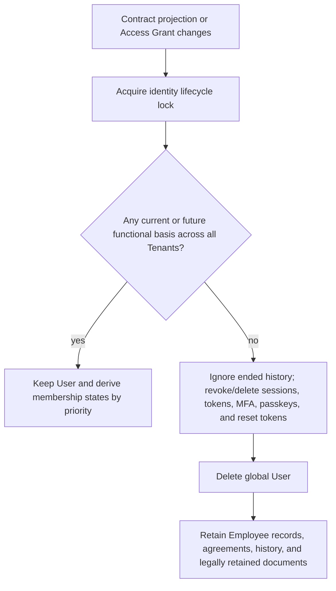

<!--
SPDX-FileCopyrightText: 2026 SecPal Contributors
SPDX-License-Identifier: CC0-1.0
-->

# ADR-014: Tenant, Identity, Employee, and Access Model

**Status:** Accepted

**Date:** 2026-07-20

**Decision authority:** SecPal Product and Domain Owner

**Decision date:** 2026-07-20

**Scope:** Cross-repository functional and technical baseline for the subsequent redesign

**Supersedes:**

- [ADR-007](20251126-organizational-structure-hierarchy.md)
- [ADR-008](20251219-user-based-tenant-resolution.md)
- [ADR-009](20251221-inheritance-blocking-and-leadership-access-control.md)

**Partially supersedes:**

- [ADR-004](20251108-rbac-spatie-temporal-extension.md)
- [ADR-005](20251111-rbac-design-decisions.md)
- [ADR-011](20251227-simplify-management-level-to-integer-field-adr011.md)

This ADR was accepted after functional and architectural review by the SecPal Product and Domain Owner.

## Context and problem statement

SecPal is at version 0.x and has neither production data nor compatibility requirements. The redesign therefore establishes a clean baseline using:

```bash
php artisan migrate:fresh --seed
```

Existing-installation data migration, transitional tables, dual writes, deprecated aliases, and compatibility endpoints are explicitly excluded. Deprecated code will be removed without replacement in later implementation changes.

The current state conflates global identity, tenant assignment, key ownership, employment status, and access. `app/Models/User.php` binds a user to `tenant_id`; `app/Http/Middleware/InjectTenantId.php` derives context from it; `app/Http/Middleware/SetTenant.php` also accepts a route value or `X-Tenant`. Functional foreign keys currently point to `tenant_keys`, and `app/Casts/EncryptedWithDek.php` resolves `TenantKey::findOrFail($attributes['tenant_id'])`. This incorrectly treats a cryptographic key container as the company itself. `LegalEntity`, `OrganizationalUnit`, its closure table, and `UserInternalOrganizationalScope` add further layers that conflict with the target model.

The supersession classifications above identify which earlier decisions this baseline replaces completely and which remain valid only in part.

## Binding domain boundaries

| Layer             | Binding meaning                                                                                                       | Must not mean                                                                                    |
| ----------------- | --------------------------------------------------------------------------------------------------------------------- | ------------------------------------------------------------------------------------------------ |
| Global User       | Tenant-independent authentication identity                                                                            | Tenant, employee record, functional role, permission, or scope                                   |
| Tenant            | Exactly one legal entity/company                                                                                      | Cryptographic key, group of legal entities, or establishment                                     |
| TenantKey         | Cryptographic key container in a 1:1 relationship with Tenant                                                         | Functional tenant identity or target of domain foreign keys                                      |
| TenantMembership  | Record that establishes a current/future User–Tenant assignment while a basis exists and may persist as ended history | Automatic functional authorization or permanent current assignment                               |
| Access Assignment | Permission or role, applicable scope targets, validity, and revocation state for a membership                         | Employee property or global authorization                                                        |
| Employee          | Tenant-bound personnel record with exactly one authoritative contract projection                                      | Concurrent current and future projections, global identity, or source of automatic authorization |
| Establishment     | Tenant establishment/branch                                                                                           | Separate tenant or legal entity                                                                  |
| Customer/Site     | Tenant customer and customer site                                                                                     | Automatic document access                                                                        |

## Tenant, TenantKey, legal entity, and provisioning

`Tenant` is the functional legal entity or company. One tenant represents exactly one legal entity. Legal entities exist only at tenant level; `LegalEntity` and every `legal_entity_id` reference are removed completely. An optional `TenantGroup` may group tenants for organizational purposes only and creates neither rights nor inheritance.

`TenantKey` is exclusively a cryptographic key container. Each tenant has exactly one TenantKey and each TenantKey belongs to exactly one tenant. `tenant_keys.tenant_id` is a unique foreign key to `tenants.id`. Every functional `tenant_id` foreign key points to `tenants.id`; no domain model uses `tenant_keys.id` as a tenant identifier. The current equivalence between `tenant_keys.id` and tenant identity is removed completely.

Tenants are provisioned exclusively through a privileged Artisan command. There is no user permission and no HTTP endpoint for creating a tenant. The command creates the Tenant, its TenantKey, and minimally required technical initial data. It grants no implicit rights and creates no implicitly privileged membership.

The same privileged operational ceremony explicitly bootstraps the first authority. After independently authorizing the operator, it creates a one-time invitation with an enumerated initial set of planned permissions and scopes. It creates neither a membership nor effective rights before acceptance. Acceptance creates the first membership and only the assignments named in the invitation. This audited bootstrap invitation is the sole exception to membership-authorized inviting; all later invitations and grants follow the normal tenant-specific delegation rules.

## Global identity and encrypted email

`User` is a global, tenant-independent authentication identity. A new user is persisted only when registration and invitation acceptance complete successfully and user, membership, and planned rights are created atomically. Incomplete registration state is not a tenantless persisted User. An existing user may have no active tenant context while membership selection is pending.

User data is limited to authentication, email, MFA, passkeys, language, global blocking, and comparable identity characteristics. `users.tenant_id` is removed. No identity has a special status or policy bypass. There are no global functional roles or permissions.

Email addresses are globally unique, normalized consistently before comparison, and compared case-insensitively. Login, invitation, and registration flows must not unnecessarily disclose whether an account exists. The target persistence model is:

- `email_enc`: application-encrypted original email address;
- `email_idx`: globally unique keyed blind index of the normalized email address.

No persistent plaintext column stores the normalized email. Login and global account lookup use `email_idx`; application code never queries ciphertext or reads `email_enc` directly. Global User data is never encrypted with a TenantKey. It uses a dedicated Global Identity Key boundary separated from every TenantKey.

The precise Global Identity Key hierarchy, root protection, rotation, recovery, backup, and operational controls remain to be defined before implementation in a separate security design or ADR. This ADR binds the separation and security properties, not a complete key implementation.

## Employee, contract, and establishment model

An Employee is exactly one personnel record in exactly one Tenant and remains when a linked global User is deleted. The Employee contains exactly one authoritative contract projection.

Before the first employment relationship begins, that one projection may contain the agreed initial contract state with a future `contract_start_date`. During an ongoing employment relationship, it contains only the currently effective contract state. A future salary change, working-hours change, extension, or other amendment is first stored as a contract, amendment, or agreement with an effective date. It must not overwrite currently effective Employee fields early. On the effective date, the affected values are applied transactionally to the Employee projection.

Contract documents, amendments, and other agreements remain historical or documentary evidence; the Employee projection is not the sole legal evidence. No general table for several simultaneously active employment contracts is introduced.

A current or future employment basis for membership lifecycle is derived from the Employee's authoritative projection and effective-dated contractual evidence. This derivation does not create a competing projection. Rehire and representation of several employment periods remain an open detail decision and must not be pre-decided through a separate general domain entity in this ADR.

During a current employment relationship, an Employee has exactly one current establishment assignment. During a future relationship, one matching future assignment must be schedulable. Assignments use `[valid_from, valid_until)`, must not overlap for the same Employee, and historical assignments never create current rights. Establishments belong to exactly one Tenant, are not legal entities or tenants, and may be closed or deactivated but must not be hard-deleted when relevant history exists.

Historical assignments must reproduce the state at the historical point in time even after the establishment is renamed, re-addressed, recoded, or closed. The implementation may use versioned establishment master data or snapshots of relevant values in the historical assignment structure; that physical choice remains open.

Termination workflows have separate states for draft, approval, printing, signature, dispatch, receipt, notice expiry, and employment end. A digital draft alone never establishes legal employment termination. A scan of the signed original may be added later. The draft, signed original, dispatch, receipt, notice expiry, and employment end remain independently auditable steps.

## Membership bases and states

Only `TenantMembership` assigns a User to a Tenant; `(user_id, tenant_id)` is unique. A membership may optionally link to exactly one Employee in the same Tenant. A User may link to different Employee records in different Tenants. A membership itself grants no functional action.

A TenantMembership establishes a functional Tenant assignment only while at least one current or future basis exists. When every basis disappears, the Tenant assignment ends. The membership record may remain in `ended` state for auditability, traceability, and legally required history. A historically retained membership record is not a current or future Tenant assignment.

Personal data in historical membership records must support minimization or pseudonymization according to purpose and retention policy. An `ended` membership grants no access, is not a selectable Tenant context, and does not prevent deletion of the global User. Before User deletion, the historical membership's direct User foreign key is set to `null`, or an equivalent non-blocking pseudonymous tombstone strategy is applied. The retained row must neither block User deletion nor be cascade-deleted with the User.

In this ADR, an effective Access Grant means a complete, effective Access Assignment and its applicable scope targets. A current or future Tenant assignment requires at least one of these bases:

1. a current or future employment relationship derived from the linked Employee's authoritative contract projection and effective-dated contractual evidence; or
2. at least one effective current or future Access Grant.

An Access Grant counts as a membership basis only when the complete combination is effective:

- a valid permission, or a role containing at least one effective permission;
- at least one applicable scope;
- a current or future validity interval;
- a non-revoked state; and
- every referenced scope target exists in the same Tenant.

A permission without scope, scope without permission, empty role, expired or revoked assignment, invalid target, or cross-tenant target does not preserve a membership.

Membership state is derived in this binding priority:

1. If no current or future basis exists, the state is `ended`.
2. If at least one current or future basis exists and an explicit security suspension applies, the state is `suspended`.
3. If at least one currently effective basis exists, the state is `active`.
4. If only future bases exist, the state is `planned`.

If every current and future basis disappears during a suspension, the membership becomes `ended`; `suspended` cannot preserve a membership without a basis. When a suspension is lifted, the complete state is derived again from the bases then present.

A planned membership prevents premature deletion of the global User and is visible as a future Tenant assignment, but cannot be selected as an active Tenant context before `valid_from`. A future employment relationship without currently effective onboarding or self-service rights therefore produces `planned`. Already-current, explicitly assigned onboarding or self-service permission, scope, and validity combinations produce `active`, even if the employment relationship begins later, and may provide a restricted context.

Only `active` can be used as an active Tenant context. `planned`, `suspended`, and `ended` are not normal selectable Tenant contexts. An `ended` record remains historical only, grants no access, and does not preserve the global User.

State evaluation is centralized and runs after every relevant contract-projection, invitation, Access Grant, or suspension change and on schedule. Assignments own only their own validity intervals; they do not replace membership lifecycle state.

## Active tenant context

The active context is a concrete active `TenantMembership`, stored in the browser session or access-token/device context. Ordinary functional requests never resolve or override it from a URL, `/tenants/{tenant}/…`, `X-Tenant`, payload, query, or `users.tenant_id`. A dedicated selection/switch command may carry only a membership identifier as its requested target. The server resolves that identifier through the authenticated User's selectable memberships and never trusts a supplied tenant identifier as authorization evidence.

When exactly one active membership exists, the system activates it automatically. When several active memberships exist, the User chooses `ask` (choose after sign-in) or `resume_last` (open the last still-active membership for that session/device). Planned, suspended, invalid, or ended memberships cannot be resumed or selected. If no active membership exists, only global flows remain available.

Every switch validates the target, invalidates the old context, and clears tenant-dependent role, permission, scope, UI, offline, and server caches before committing the new context and exposing its data. A failed switch leaves no mixed context. Bearer-token switching rotates or revokes the previous tenant-bound token, or atomically updates an equivalent server-side context reference.

## Permission, scope, validity, and delegation

All functional roles and permissions are Tenant-specific and assigned exclusively to a TenantMembership. Assignments may be current, future, time-limited, revoked, or expired. Authorization always combines:

- **Permission:** Which action is allowed?
- **Scope:** Which data or resources does the action apply to?
- **Validity:** When is the assignment effective, using `[valid_from, valid_until)`?

Scopes support at least:

- the entire Tenant;
- an individual Establishment;
- an individual Customer;
- an individual `Site`;
- `linked_employee`, covering only the Employee linked to the current membership.

Self-service examples are `employee.profile.read + linked_employee`, `onboarding.self.read + linked_employee`, and `onboarding.self.update + linked_employee`. The scope grants no implicit action. Without an explicitly assigned permission and effective validity, no self-service access exists.

One functional Access Assignment may have several concrete targets when they share the same permission or role, validity, and delegation basis. This functional multiplicity is binding. The physical representation remains open: a separate scope-target table, resource-specific scope tables, or another relational design with enforceable foreign keys may be used. Free polymorphic resource references without robust Tenant integrity are not the target design.

Every concrete target must exist in the assignment membership's Tenant when assigned and whenever authorization is evaluated. Tenant-wide scope is derived from the membership's Tenant. Cross-tenant targets are invalid. Database constraints enforce Tenant integrity wherever representable; mandatory service-level checks cover invariants that cannot be expressed fully in the schema.

Examples include `employees.read` for Bremen, `guardbook.write` for Airport, `site_documents.read` for selected customer sites, and explicitly assigned tenant-wide access. Employee status, establishment assignment, position, management level, and contract never grant rights automatically.

Except for the audited bootstrap invitation, inviting requires an explicit Tenant-specific permission. Assigning roles, permissions, or scopes requires separate permissions; `memberships.invite` alone cannot grant arbitrary rights. Delegation is limited to the assigner's own active membership and Tenant and to an explicit catalog of grantable rights. No generic assignment permission permits arbitrary privilege amplification; granted scope and validity cannot exceed the applicable delegation boundary. The first membership has no implicit special position: its authority consists solely of explicit bootstrap assignments.

## Invitation, membership-end, and user-deletion lifecycles

An invitation is Tenant-bound, one-time, time-limited, and token-based; only a unique token hash is stored. It is not a membership. The supplied email is normalized at the application boundary and looked up only through `users.email_idx`, without persisting normalized plaintext or unnecessarily disclosing account existence to the inviter.

An existing User accepts with the existing account. A new User receives a registration link and is created only on successful completion. Acceptance locks and atomically consumes the invitation, revalidates its Tenant, planned rights, scopes, and validity, and creates or reactivates User, membership, and planned rights exactly once. Concurrent or replayed acceptance cannot create duplicates. Invitation validity and planned-rights validity are separate.

When the last current or future contract basis ends and no effective current or future Access Grant remains, the functional Tenant assignment ends and the membership record becomes `ended`. The retained record is historical only. Every flow that adds, changes, accepts, revokes, or expires a basis acquires the same identity lifecycle lock. The Tenant-spanning decision rechecks all bases in the same transaction so concurrent contract, invitation, or Access Grant changes cannot race with deletion.

The global User is deleted when no current or future functional basis remains across all Tenants. The check includes active and planned memberships, the bases underlying suspended memberships, current or future employment relationships, current or future effective Access Grants, and already accepted access processes only insofar as they have created such a basis. A suspension itself is not a basis. Historical `ended` membership records do not prevent deletion.

The following do not count as a basis: `ended` memberships, audit/history records, expired or revoked rights, empty roles, permissions without scope, scopes without permission, invalid targets, cross-Tenant targets, and unaccepted invitations as such. A later acceptance may atomically create a new User and a new or reactivated membership, but the invitation does not necessarily prevent earlier deletion of an otherwise unnecessary account.

Ended memberships are denied immediately; credential cleanup is idempotent and fail-closed. Before deletion, sessions, access and reset tokens, MFA, passkeys, and other credentials are revoked or deleted. Employee records, agreements, establishment history, and legally retained documents remain. One ending Employee record must not delete a User with another current or future basis.

A future customer user remains a global User with membership in the security company's Tenant and Customer/Site scopes. A Customer does not become a Tenant. A resource scope does not make every document visible; explicit approval or visibility classification is additionally required.

## Encryption at Rest and Key Boundaries

Sensitive personal, financial, health-related, and security-relevant data is application-encrypted before persistent storage. Tenant-specific sensitive data uses Tenant-specific key material resolved through `Tenant → TenantKey`. Non-sensitive reference, status, and relationship data does not require blanket encryption. Foreign keys, UUIDs, and technical identifiers required for joins generally remain plaintext.

Audit logs contain no decrypted sensitive values. Ciphertext must not be exposed accidentally through API serialization, errors, or logs. Infrastructure encryption for disks, databases, object storage, and backups is additionally required and does not replace application encryption. Key rotation, key recovery, backups, and loss of the root KEK are mandatory operational concerns.

### Schema-defined sensitive fields

A sensitive field uses `field_enc`. When a necessary equality search exists, it uses `field_enc` plus `field_idx`. The blind index is an HMAC or comparably keyed index, uses Tenant-specific index-key material for Tenant data, contains no plaintext, and is created only for an explicitly required search.

Global User email follows the same encrypted-value/blind-index pattern but uses the separate Global Identity Key boundary. It does not use a TenantKey.

### Dynamic sensitive data

Sensitive JSON, array, and form data must not be persisted unencrypted. Tenant-specific dynamic data is encrypted with a Tenant-specific boundary. Shared `APP_KEY` encryption alone is not the target for highly sensitive Tenant data. The concrete Tenant-specific JSON/blob encryption format is an implementation detail.

### Sensitive files

Tenant-specific sensitive files are encrypted before storage, including Employee documents, onboarding files, contract documents, amendments and agreements, termination letters and scans, receipt/delivery evidence, and other personnel-record documents. Storage contains only ciphertext and necessary technical metadata. Plaintext temporary files should be avoided and, when unavoidable, deleted reliably immediately after use.

## Searching encrypted data

Ciphertext is never searched directly. Exact equality searches use normalized keyed blind indexes. Blind indexes preserve exact, normalized, case-insensitive lookup where required and do not enable general decryption.

Typical supported searches include exact normalized surname, exact forename, exact date of birth, normalized phone number, global normalized User email, and other explicitly defined equality searches.

Without additional specialized search indexes, the model does not support `LIKE`, arbitrary substring search, fuzzy search, full-text search, sorting by the encrypted value, or range queries over encrypted numbers or dates. Blind indexes are created only where functionally necessary because deterministic indexes reveal equality relationships between records.

## Establishment, Customer, Site, and customer-portal boundaries

Each Establishment, Customer, and Site belongs to exactly one Tenant. Establishments are internal branches; Customers and Sites represent customer-facing operational resources. None is a legal entity inside the Tenant and none becomes a Tenant automatically.

Customer-portal capability remains possible through global Users, TenantMemberships, and Customer/Site scopes. The portal itself is not part of the first implementation. Scope alone never makes all data or documents visible; explicit release or visibility classification remains required.

## BWR target model

The existing CSV/XML BWR file export is deprecated and will be removed without replacement. There is no evidenced functional import path at the Bewacherregister that requires these files. No deprecated endpoint or compatibility response is retained.

Removal includes:

- `app/Services/BewacherregisterExportService.php`;
- `app/Exceptions/BewacherregisterExportNotReadyException.php`;
- BWR export and download methods in `app/Http/Controllers/Api/V1/EmployeeController.php`;
- BWR export and download routes in `routes/api.php`;
- `app/Http/Requests/ExportEmployeeBwrRequest.php`;
- related permissions, unit and feature tests, OpenAPI contracts, and README, compliance, changelog, and translation text for file export.

The removal does not automatically remove the BWR ID, BWR status, manual-notification date, authority-decision date and result, status changes, BWR-related compliance checks, or documented manual processing in the Bewacherregister. The file export ends; the functional BWR process may remain.

## Audit, data protection, and retention boundaries

Retention is modeled per document/data category, at minimum with `retention_class`, `retention_until`, `legal_basis`, and optionally `legal_hold_until`. No single retention period may delete an entire personnel record indiscriminately. Detailed legal retention periods must be separately validated as compliance requirements; this ADR defines none.

Audit records Tenant switches, invitations, rights grants/revocations, membership state changes, User deletion, key operations, and termination-workflow state transitions without unnecessarily duplicating sensitive content. Records reference actors and objects, not plaintext secrets, decrypted values, or complete personnel documents.

## Domain overview

```mermaid
erDiagram
    TENANT ||--|| TENANT_KEY : owns_key_container
    TENANT_GROUP o|--o{ TENANT : groups_organizationally
    USER o|--o{ TENANT_MEMBERSHIP : links_while_retained
    TENANT ||--o{ TENANT_MEMBERSHIP : contains
    TENANT ||--o{ ESTABLISHMENT : owns
    TENANT ||--o{ EMPLOYEE : owns_record
    TENANT_MEMBERSHIP o|--o| EMPLOYEE : optionally_links
    EMPLOYEE ||--o{ EMPLOYEE_ESTABLISHMENT_ASSIGNMENT : assigned_over_time
    ESTABLISHMENT ||--o{ EMPLOYEE_ESTABLISHMENT_ASSIGNMENT : receives
    EMPLOYEE ||--o{ AGREEMENT_DOCUMENT : evidences_history
    TENANT_MEMBERSHIP ||--o{ ACCESS_ASSIGNMENT : receives
    ACCESS_ASSIGNMENT ||--o{ ACCESS_SCOPE_TARGET : limits
    TENANT ||--o{ CUSTOMER : owns
    CUSTOMER ||--o{ SITE : owns
    TENANT ||--o{ INVITATION : issues
    INVITATION }o--o| TENANT_MEMBERSHIP : activates_on_acceptance
    TENANT_KEY {
      uuid id
      uuid tenant_id UK_FK
      binary encrypted_key_material
    }
    USER {
      uuid id
      text email_enc
      string email_idx UK
      string auth_identity
    }
    TENANT_MEMBERSHIP {
      uuid id
      uuid user_id_nullable
      uuid tenant_id
      uuid employee_id_nullable
      string state
    }
    EMPLOYEE {
      uuid id
      uuid tenant_id
      string effective_contract_projection
    }
    ACCESS_ASSIGNMENT {
      uuid id
      uuid membership_id
      string permission_or_role
      datetime valid_from
      datetime valid_until_nullable
      datetime revoked_at_nullable
    }
    ACCESS_SCOPE_TARGET {
      uuid access_assignment_id
      string scope_type
      uuid resource_id_nullable
    }
```

The diagram is conceptual. `effective_contract_projection` is the one authoritative Employee projection: it may represent the agreed initial state before first employment begins, and otherwise represents only the currently effective state. Future changes remain effective-dated contractual evidence until transactionally applied. A membership row may persist in `ended` state as history without representing a current or future Tenant assignment. Its direct User link is nullable so User deletion can use `SET NULL`, or an equivalent pseudonymous tombstone design, without deleting the historical row. An Access Assignment can have several scope targets; the physical relational design remains open. Several historical invitations may activate or reactivate one membership, while each invitation activates at most one membership. `TenantGroup` intentionally has no edge to access. `LegalEntity`, `OrganizationalUnit`, closure tables, `UserInternalOrganizationalScope`, replacement hierarchies, reporting lines, and simultaneous current establishment assignments for one Employee are prohibited.

## Authentication and tenant-selection flow

```mermaid
sequenceDiagram
    participant U as User
    participant C as Browser/App
    participant A as Auth service
    participant M as Membership service
    participant S as Session/Token context
    U->>C: sign in
    C->>A: authenticate through email_idx lookup
    A->>M: determine active memberships
    alt exactly one active membership
        M-->>S: store membership as active context
    else several active memberships + ask
        M-->>C: offer active memberships
        U->>C: choose membership
        C->>S: validate and activate membership
    else several active memberships + resume_last
        M->>S: validate last membership
        alt still active
            S-->>C: resume last membership
        else invalid, planned, suspended, or ended
            M-->>C: require new selection
        end
    else no active membership
        M-->>C: no tenant context; global flows only
    end
    C->>A: functional request
    A->>S: validate active membership
    A->>M: validate permission + scope + validity
    M-->>A: allow or deny
    A-->>C: tenant-isolated response
    Note over C,S: A switch clears every tenant-dependent cache before exposing data
```

## Invitation flow

```mermaid
sequenceDiagram
    participant I as Inviting membership
    participant S as Invitation service
    participant U as Global User
    participant R as Registration
    Note over I,S: Bootstrap uses the privileged command and explicit planned assignments
    I->>S: invite with tenant-specific permission
    S->>S: normalize email; derive email_idx; hash token; store expiry
    alt User exists
        S-->>U: neutral acceptance message
        U->>S: accept with existing account
    else User does not exist
        S-->>R: registration link
        R->>S: complete registration successfully
    end
    S->>S: lock and consume invitation; revalidate all planned grants
    S->>S: atomically create/reactivate User, membership, and planned rights
    S-->>U: membership state derives from effective bases
```

## User-deletion lifecycle



## Consequences

Positive consequences are clear Tenant isolation, multi-Tenant identities without duplicates, separation between companies and key containers, no implicit rights derivation, time-bound authorization, searchable encrypted equality fields, and legally separated HR lifecycles. Customer-portal capability remains possible without a separate Customer Tenant.

Negative consequences are new Tenant and membership context infrastructure, a separate global identity key boundary, explicit blind-index and key operations, more lifecycle checks, demanding atomic invitation transactions, and compulsory cache invalidation on context switch. Restricted encrypted search is an intentional confidentiality trade-off. These costs are accepted because they preserve Tenant isolation and clear functional boundaries.

## Explicitly rejected alternatives

- A User with exactly one Tenant or `users.tenant_id` as primary context.
- Tenant resolution from route, subdomain, `X-Tenant`, request payload, or query.
- Treating `tenant_keys.id` as a functional Tenant identifier.
- Encrypting global identity data with a TenantKey.
- `Admin`, `Tenant-Admin`, `Superuser`, global functional roles/permissions, or any equivalent special privileged role/status.
- `LegalEntity` or several legal entities within one Tenant.
- `OrganizationalUnit`, replacement hierarchies, closure tables, `UserInternalOrganizationalScope`, management/reporting lines.
- A separate general domain entity for contract periods or multiple simultaneously active employment contracts.
- Parallel current establishment assignments or rights derived from Employee properties.
- Permission without scope, scope without permission, empty role, or invalid target as a membership basis.
- An invitation as an immediately effective membership.
- User deletion because one Employee record ends.
- Plaintext sensitive dynamic data or Tenant-sensitive data protected only by a shared `APP_KEY`.
- Retaining the BWR CSV/XML export through deprecated endpoints or compatibility responses.
- Backward-compatibility layers, transitional tables, dual writes, and deprecated aliases.

## Cross-repository impact inventory

### `SecPal/api`

- **Tenant/key split:** Introduce a functional Tenant model/table; change all functional `tenant_id` foreign keys to `tenants.id`; change TenantKey to a 1:1 key container with unique `tenant_keys.tenant_id`; remove every `TenantKey::find(tenant_id)` assumption. `app/Models/TenantKey.php`, Tenant factories, seeders, provisioning commands, key commands, migrations, and tenant-isolation tests are affected.
- **Identity/membership/context:** `app/Models/User.php`, `routes/api.php`, `app/Http/Middleware/InjectTenantId.php`, `SetTenant.php`, and `AuthController.php` move to global User plus membership context. `/tenants/{tenant}` and `X-Tenant` context resolution are removed. New components include TenantMembership, priority-based membership-state evaluation, retained `ended` history with minimization/pseudonymization, Invitation, Access Assignment/scope targets, lifecycle locking, and session/Sanctum/device membership context.
- **Authorization:** `app/Policies/*`, `RoleController.php`, `Api/V1/UserPermissionController.php`, `TemporalRoleUser.php`, `CustomerAssignment.php`, `SiteAssignment.php`, and `config/permission.php` must authorize only active memberships and effective permission/scope/validity combinations. Tests must cover state priority, basis loss during suspension, planned onboarding transitions, ended-history denial, empty/expired/revoked grants, invalid or cross-Tenant targets, `linked_employee`, delegation ceilings, and cache invalidation.
- **Employee/contracts/establishments:** Keep exactly one authoritative contract projection directly on `app/Models/Employee.php`. Before first employment it may contain the agreed future initial state; during employment it contains only currently effective values. Store future changes as effective-dated contractual evidence and apply them transactionally on their effective date. Add historical agreement/document and establishment-assignment concepts without a separate general contract-period domain entity. Test non-premature projection updates, transactional effective-date application, historical evidence, snapshots/versioning, assignment non-overlap, current assignment, and future scheduling.
- **Deprecated legal/hierarchy code:** Remove `LegalEntity.php`, `OrganizationalUnit.php`, `OrganizationalUnitClosure.php`, `UserInternalOrganizationalScope.php`, their migrations/factories/seeders/requests/resources/policies/controllers/routes/tests, `OrganizationalUnitAccessService.php`, `OrganizationalScopeEntitlementService.php`, `CheckOrganizationalScope.php`, and `AssignableOrganizationalUnit.php`. Remove every `legal_entity_id`. No replacement hierarchy is introduced.
- **Site assignment service:** Do not delete `app/Services/OrganizationalUnitAssignmentService.php` wholesale. Analyze its Site/SiteAssignment validity and coverage logic, remove actual OrganizationalUnit and `legal_entity_id` dependencies, and rename or move retained behavior into an appropriate Site-assignment or Site-access service.
- **Encryption to retain and adapt:** Keep `app/Casts/EncryptedWithDek.php`, existing encrypted Employee and EmployeeAddress fields, Tenant-specific blind-index logic, existing key-rotation mechanisms, `app/Services/EmployeeDocumentStorageService.php`, and `app/Services/OnboardingSubmissionFileStorageService.php`. Resolve keys through `Tenant → TenantKey`; never call `TenantKey::find(tenant_id)`.
- **Encryption to review and improve:** `app/Models/OnboardingFormSubmission.php` currently uses Laravel `encrypted:array` for `form_data`, which does not establish a Tenant-specific key boundary. Move it to Tenant-specific encryption. Review sensitive Employee and other JSON/array fields; insurance, contact, financial, health, and security fields; file metadata for unnecessary plaintext; export and temporary paths; and all new contract, termination, and personnel-record documents.
- **Global identity encryption:** Add `users.email_enc` and globally unique `users.email_idx`, normalization and lookup services, and a separate Global Identity Key boundary. A separate security design/ADR must define concrete key hierarchy, rotation, recovery, backup, and operations before implementation.
- **BWR export removal:** Delete `app/Services/BewacherregisterExportService.php`, `app/Exceptions/BewacherregisterExportNotReadyException.php`, `app/Http/Requests/ExportEmployeeBwrRequest.php`, export/download methods in `app/Http/Controllers/Api/V1/EmployeeController.php`, routes in `routes/api.php`, related permissions, `tests/Unit/Services/BewacherregisterExportServiceTest.php`, other export/download feature tests, OpenAPI contracts, and README/compliance/changelog/translation text. Preserve and reassess BWR ID, status, manual-reporting dates, authority decisions, state changes, compliance checks, and documented manual processing.
- **Lifecycle/audit/retention:** Centralize Tenant-spanning basis checks, credential revocation, invitation locking, priority-based membership state, document visibility, retention classification, legal hold, historical membership minimization/pseudonymization, nullable or equivalent tombstoned historical User links, and audit redaction. Ended history does not preserve a User and is not cascade-deleted with one. Employee records and retained documents survive User deletion.
- **High-risk tests:** Replace `tests/Feature/SetTenantMiddlewareTest.php`, `InjectTenantIdMiddlewareTest.php`, `UserTenantRelationshipTest.php`, LegalEntity/OrganizationalUnit tests, `RoleApiTest.php`, `UserPermissionAssignmentApiTest.php`, `TemporalRoleUserTest.php`, Employee lifecycle, contract-projection scheduling, membership-state priority, ended-history deletion, key-resolution, encryption, invitation-concurrency, credential-revocation, file-ciphertext, and cross-Tenant tests. Existing behavior tests are replaced as a breaking baseline, not carried through aliases.

### `SecPal/contracts`

- `docs/openapi.yaml` currently describes `tenant_id`, `legal_entity_id`, Organizational Units, User roles/permissions, BWR file export, and legacy Employee/Customer/Site assignments. Remove obsolete schemas and endpoints without aliases.
- Add contracts for the prioritized membership states, active-only selection/switching, historical ended-record semantics, invitation acceptance, effective time-bound Access Grants with multiple targets, `linked_employee`, the single authoritative Employee contract projection, effective-dated contractual changes, establishment history, document visibility, and termination states.
- Never expose encrypted storage fields, blind-index fields, key identifiers, or decrypted values beyond explicitly authorized resource fields. Document equality-search capabilities and unsupported search behavior where relevant.
- Update `scripts/check-domain-contracts.mjs`, `scripts/check-openapi-verified-endpoints.mjs`, and their tests for the breaking baseline.

### `SecPal/frontend`

- Remove OrganizationalUnit and LegalEntity contracts/components, including `src/components/Organizational*`, `src/hooks/useOrganizationalUnitsWithOffline.ts`, `src/pages/Organization/OrganizationPage.tsx`, and relevant generated types/tests. Remove BWR file-export UI and copy.
- Update `src/contexts/AuthContext.tsx`, `src/lib/offlineSessionState.ts`, `src/lib/clientStateCleanup.ts`, route guards, and offline storage for priority-derived membership states, active-only `ask`/`resume_last`, restricted onboarding/self-service context, switch invalidation, and complete Tenant cache clearing.
- Add UI for invitation/registration, explicit grant/scope/validity management, `linked_employee` self-service, establishment history, document visibility, and only supported encrypted-field searches.
- Test that planned/suspended/ended memberships cannot be selected, basis loss changes suspended to ended, historical memberships do not preserve global Users, switches expose no stale Tenant data, account-existence disclosure is neutral, and IndexedDB/offline vault boundaries hold.

### `SecPal/android`

- `docs/ANDROID_AUTH_ARCHITECTURE.md`, `KeystoreTokenStorage.java`, `NativeAuthHttpClient.java`, `SecPalNativeAuthPlugin.java`, `ProvisioningBootstrapCoordinator.java`, and `src/secpal/native-auth-bridge.ts` must bind bearer-token/device context to an active membership.
- Membership switching and revocation clear token- and Tenant-dependent native/browser caches. Planned, suspended, and ended memberships cannot become device context. Provisioning QR/URL data is never authorization evidence.
- Extend Keystore-token, native-auth, bootstrap, and logout tests for context switching, invalid membership, credential revocation, and redaction. Raw tokens and sensitive decrypted values remain outside JavaScript.

### `SecPal/secpal.app`

- The public site has no functional Tenant/HR domain. Relevant future touchpoints are invitation/registration links and privacy/security text in `src/i18n/*` and privacy pages.
- Decide before implementation whether public invitation/registration stays on `app.secpal.dev`. Public behavior must disclose neither Tenant context nor account existence and must describe encryption/retention accurately.
- Domain and copy tests must prevent unsupported privacy claims or impermissible Tenant resolution.

### `SecPal/.github`

- Mark superseded ADRs and `docs/adr/README.md` consistently against this accepted baseline. Align `docs/openapi.md`, `docs/legal-compliance.md`, `docs/feature-requirements.md`, architecture guidance, and validation scripts.
- Track the separate Global Identity Key security design/ADR and repository-specific implementation sub-issues before implementation begins.
- Ensure reusable checks reject old TenantKey-as-Tenant assumptions, deprecated API surfaces, domain-policy drift, and unlicensed architecture documentation.

## Open detail decisions before implementation phases

1. Names, key types, constraints, and delete/soft-delete semantics of new tables beyond the binding Tenant/TenantKey and personal-data invariants.
2. Concrete Global Identity Key hierarchy, root protection, rotation, recovery, backup, and operational ownership in a separate security design/ADR.
3. Concrete Tenant key hierarchy and operational recovery/rotation processes while preserving the `Tenant → TenantKey` boundary.
4. Role packaging and the concrete delegable-permission catalog within the no-arbitrary-amplification rule.
5. Physical scope-target representation while preserving multiple targets, enforceable Tenant integrity, and no unsafe free polymorphic references.
6. Exact meaning of “current” for time zones, scheduled evaluation, `valid_until`, and future invitations/grants.
7. Token/session representation, rotation, and revocation propagation while preserving atomic fail-closed switching.
8. Rehire and representation of several employment periods without pre-deciding a separate general domain entity or parallel active contracts.
9. Versioned Establishment master data versus snapshots in historical assignments.
10. Detailed contract/termination state machine and authoritative evidence for receipt, notice expiry, and employment end.
11. Data categories, visibility classifications, legal bases, retention periods, legal-hold process, and minimization/pseudonymization rules for historical membership records after compliance validation.
12. Public invitation/registration URLs, rate limits, and abuse protection without account-existence disclosure.
13. Tenant-command interface, operator authorization, seed content, bootstrap invitation parameters, and audit shape.
14. Customer-portal document-release model and whether Customer users may access additional Tenants.
15. Specialized encrypted search requirements beyond the binding equality searches, including leakage analysis for any additional index.

## Implementation order

1. Complete the Global Identity Key security design.
2. Define the clean Tenant/TenantKey, User, membership, Employee projection, access, encryption, and history schemas and API contracts.
3. Implement API key resolution, context, membership lifecycle, authorization, encryption, BWR-export removal, and tests.
4. Implement frontend context, cache clearing, search constraints, and new workflows against the contracts.
5. Adapt Android token/device context and revocation.
6. Align superseded ADRs, documentation, checks, and public text.

None of these phases introduces compatibility mechanisms for concepts rejected by this ADR.

## Related work

- [SecPal/api#1345](https://github.com/SecPal/api/issues/1345) coordinates cross-repository implementation.
- [SecPal/api#1346](https://github.com/SecPal/api/pull/1346) contains the original ADR review history and is intentionally closed without merge after centralization.
