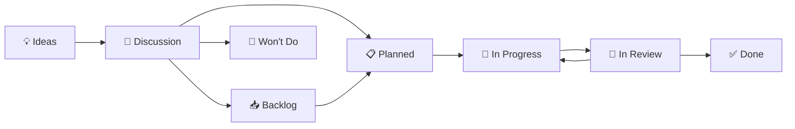

<!--
SPDX-FileCopyrightText: 2025-2026 SecPal
SPDX-License-Identifier: CC0-1.0
-->

# GitHub Project Board Integration

This document explains how the optional SecPal GitHub Project board mirrors issue and pull request progress.

## Position In The Planning Model

The project board is a convenience layer, not the planning source of truth.

- canonical planning lives in GitHub Issues, labels, milestones, ADRs, and linked PRs
- the board gives a cross-repository visual view when it is enabled
- board fields and status columns must never be the only place where scope or acceptance criteria exist

See `docs/planning.md` for the canonical governance rules.

## What The Board Is For

Use the board for:

- visualizing cross-repository throughput
- weekly or release triage
- seeing which issues are in discussion, planned, in progress, or under review
- following draft PR workflows in a single-maintainer setup

Do not use the board for:

- storing the only copy of requirements
- replacing issues, milestones, or ADRs
- publishing the public roadmap directly

## Recommended Status Flow

These statuses reflect issue and PR state. They do not replace issue metadata.

## Recommended Workflow

1. Create or refine an issue in the correct repository.
2. Add labels, milestone, and any epic/sub-issue links.
3. Let automation add or update the board item when available.
4. Open a draft PR linked to the issue.
5. Let PR state changes mirror progress on the board.

If the board is unavailable, skip step 3 and continue with the issue-first workflow.

## Automation Contract

The board automation should only mirror durable GitHub state:

- issue opened, reopened, closed
- linked PR opened, converted to draft, marked ready, merged
- review state that sends a linked issue back to in-progress work

The automation must not invent planning decisions that are missing from issues or milestones.

Operational details for the current automation live in `docs/workflows/PROJECT_AUTOMATION.md`.

## Public Roadmap Boundary

The public roadmap is a curated public artifact.

- it should be derived from selected public-safe issues and milestones
- it must not depend on private board-only notes or hidden internal fields
- it is tracked separately in `SecPal/secpal.app#61`

## Related Documents

- `docs/planning.md`
- `docs/EPIC_WORKFLOW.md`
- `docs/labels.md`
- `docs/workflows/PROJECT_AUTOMATION.md`
