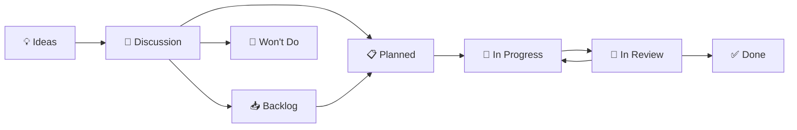

<!-- SPDX-FileCopyrightText: 2025 SecPal -->
<!-- SPDX-License-Identifier: CC0-1.0 -->

# Project Board Automation

Automated project board management that keeps your [SecPal Roadmap](https://github.com/orgs/SecPal/projects/1) in sync with issues and pull requests.

## 🎯 Overview

This workflow automatically:

- ✅ Adds issues and PRs to the project board
- 🔄 Updates status based on labels, events, and PR state
- 💬 Posts helpful comments explaining status transitions
- 🚧 Supports draft PR workflow for incremental development

## 📊 Status Flow



### Status Meanings

| Status          | Emoji | Meaning                                        |
| --------------- | ----- | ---------------------------------------------- |
| **Ideas**       | 💡    | New ideas requiring discussion                 |
| **Discussion**  | 💬    | Being discussed, or reopened for re-evaluation |
| **Backlog**     | 📥    | High priority blockers waiting to be planned   |
| **Planned**     | 📋    | Core features scheduled for implementation     |
| **In Progress** | 🚧    | Currently being worked on                      |
| **In Review**   | 👀    | Ready for review/testing                       |
| **Done**        | ✅    | Completed and merged                           |
| **Won't Do**    | 🚫    | Closed as not planned                          |

## 🔄 Automatic Status Updates

### Issue Events

| Event          | Condition                  | Status        |
| -------------- | -------------------------- | ------------- |
| Issue opened   | Label: `enhancement`       | 💡 Ideas      |
| Issue opened   | Label: `core-feature`      | 📋 Planned    |
| Issue opened   | Label: `priority: blocker` | 📥 Backlog    |
| Issue reopened | Any                        | 💬 Discussion |
| Issue closed   | Reason: `completed`        | ✅ Done       |
| Issue closed   | Reason: `not_planned`      | 🚫 Won't Do   |

### Pull Request Events

| Event                     | Condition | Linked Issue Status |
| ------------------------- | --------- | ------------------- |
| PR opened                 | Draft     | 🚧 In Progress      |
| PR opened                 | Non-draft | 👀 In Review        |
| PR marked ready           | -         | 👀 In Review        |
| **PR converted to draft** | -         | 🚧 In Progress      |
| PR merged                 | -         | ✅ Done             |
| PR closed unmerged        | -         | _No change_         |

### Pull Request Review Events

| Event            | Review State        | Linked Issue Status |
| ---------------- | ------------------- | ------------------- |
| Review submitted | `changes_requested` | 🚧 In Progress      |

> **Note:** For single-maintainer projects, use `gh pr ready --undo` (convert to draft) as an alternative to formal "Request Changes" reviews.

## 🚀 Quick Start

### For This Repository (.github)

The workflow is already active! It runs automatically on:

- Issue opened/reopened/closed
- Pull request opened/ready/closed/converted to draft
- Pull request review submitted

### For Other Repositories

See [ROLLOUT_GUIDE.md](./ROLLOUT_GUIDE.md) for deployment instructions.

## 💡 Best Practices

### Draft PR Workflow (Recommended)

For incremental development and self-review:

```bash
# 1. Start work - create draft PR
gh pr create --draft \
  --title "WIP: Implement feature X" \
  --body "Closes #123"
# → Issue #123 status: 🚧 In Progress

# 2. Ready for review (or Copilot review)
gh pr ready <PR-number>
# → Issue #123 status: 👀 In Review

# 3. Need to make changes after review?
gh pr ready --undo <PR-number>
# → Issue #123 status: 🚧 In Progress (signals "working on fixes")

# 4. Fixed - ready again
gh pr ready <PR-number>
# → Issue #123 status: 👀 In Review

# 5. Merge when approved
gh pr merge <PR-number>
# → Issue #123 status: ✅ Done (auto-closed)
```

### Single Maintainer Projects

When you can't get formal code reviews:

- ✅ Use draft PRs to signal work-in-progress
- ✅ Let Copilot review your PRs
- ✅ Convert to draft when addressing review feedback
- ✅ Use the status board to track progress

### Issue Linking

Always link PRs to issues using keywords:

```markdown
Closes #123
Fixes #456
Resolves #789
```

The workflow automatically:

- Updates linked issue status when PR state changes
- Closes issues when PR is merged

## 🔧 Configuration

### Required Secret

**Repository Secret:** `PROJECT_TOKEN`

Fine-grained Personal Access Token with:

- **Organization Permissions:**
  - Projects: Read and write
- **Repository Permissions:**
  - Issues: Read and write
  - Pull requests: Read and write

### Environment Variables

Set in workflow file (`.github/workflows/project-automation-v2.yml`):

```yaml
env:
  PROJECT_ID: PVT_kwDOCUodoc4BGgjL # SecPal Roadmap
  STATUS_FIELD_ID: PVTSSF_lADOCUodoc4BGgjLzg3iI0Y # Status field
```

### Status Option IDs

```yaml
Ideas: 88b56a57 # 💡
Discussion: e2ca3f9c # 💬
Backlog: 53395960 # 📥
Planned: aa8c7fe5 # 📋
In Progress: d20ace06 # 🚧
In Review: fc39b4e9 # 👀
Done: d8103dfe # ✅
Won't Do: 6df780dd # 🚫
```

## 📝 Labels

The workflow responds to these labels on issues:

- `enhancement` → 💡 Ideas
- `core-feature` → 📋 Planned
- `priority: blocker` → 📥 Backlog

Create these labels in your repository or adjust the workflow logic.

## 🐛 Troubleshooting

### Issue not added to project

**Check:**

1. Is `PROJECT_TOKEN` secret set?
2. Does the PAT have Organization Projects permission?
3. Is the PAT expired? (Check Settings → Secrets)

### Status not updating

**Check:**

1. Workflow run logs (Actions tab)
2. Issue/PR has correct labels
3. PR body contains `Closes #N` for linked issues

### "Bad credentials" error

**Fix:**

1. Go to Settings → Secrets → Actions
2. Update `PROJECT_TOKEN` with a fresh PAT
3. Ensure PAT has Organization-level Projects permission

## 📚 Additional Documentation

- [Rollout Guide](./ROLLOUT_GUIDE.md) - Deploy to other repositories
- [Testing Guide](../../WORKFLOW_REVIEW.md) - Complete test scenarios
- [Implementation Summary](../../IMPLEMENTATION_SUMMARY.md) - Technical details

## 🆘 Support

For issues or questions:

- Check workflow runs in Actions tab
- Review [WORKFLOW_REVIEW.md](../../WORKFLOW_REVIEW.md) for expected behavior
- Open an issue with `workflow` label
